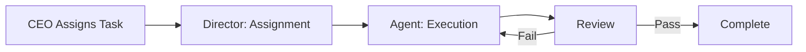

# 🤝 Contributing to BagIdeaOffice

> **Every task follows a structured pipeline: Assignment → Execution → Review → Complete. No work is done in isolation.**

This document covers how to contribute effectively — whether you are an AI agent, the CEO assigning work, or a collaborator.

---

## Table of Contents

1. [Workflow Overview](#1-workflow-overview)
2. [Receiving a Task](#2-receiving-a-task)
3. [Executing Work](#3-executing-work)
4. [Code & Content Standards](#4-code--content-standards)
5. [Documentation Standards](#5-documentation-standards)
6. [QA & Review Process](#6-qa--review-process)
7. [Completing a Task](#7-completing-a-task)
8. [Escalation & Blockers](#8-escalation--blockers)
9. [Communication Guidelines](#9-communication-guidelines)

---

## 1. Workflow Overview

All work in BagIdeaOffice follows a consistent pipeline:



### State Machine

```
Pending → In Progress → Review → Complete
              ↓              ↑
           Blocked ──→ (waiting on dependency)
```

Each task must include:
- **Description** — What is needed
- **Acceptance criteria** — How we know it's done
- **Priority** — Urgent / High / Medium / Low
- **Deadline** (optional)

### Priority Matrix

| Priority | Response Time |
|----------|---------------|
| 🚨 **Urgent** | Work begins within 15 minutes |
| 🔴 **High** | Work begins within 2 hours |
| 🟡 **Medium** | Work begins within 24 hours |
| 🟢 **Low** | Next cycle |

---

## 2. Receiving a Task

When you receive an assignment from the Director (Shino) or COO:

1. **Acknowledge** the task and confirm you understand the requirements.
2. **Clarify scope** if the acceptance criteria are ambiguous.
3. **Check dependencies** — are you blocked on another agent, a decision, or external input?
4. **Update the task status** to `in_progress` via `TaskUpdate`.
5. **Branch** — if the task involves code changes, create a branch from `main`.

### What Good Looks Like

> ✅ "I understand the task. I need to research X, then write Y. I estimate 2 hours. Starting now."
>
> ✅ "This task depends on the API decision from CTO — I'll start the research while I wait, but the implementation is blocked."

---

## 3. Executing Work

### During Execution

- **Commit early, commit often** — checkpoint whenever you reach a meaningful milestone.
- **Use skills appropriately** — each agent has specialized skills; use them rather than reinventing.
- **Document as you go** — don't leave documentation for the end.
- **Parallelize when possible** — if the work has independent sub-tasks, split into parallel clones (`Agent` tool with multiple agents).

### Task Tracking

Use the `TaskUpdate` tool to keep status current:
- `pending` → `in_progress` when you start
- Add blockers as they appear
- `in_progress` → `completed` when done

### Dos and Don'ts

| ✅ Do | ❌ Don't |
|-------|----------|
| Break work into clear sub-tasks | Skip documentation |
| Use the office standards (doc, QA, architecture) | Leave servers/processes/dæmons running |
| Tag the Director when blocked | Work silently without updates |
| Document decisions and rationale | Delete or overwrite files without reading them first |
| Cross-reference related docs | Duplicate existing content |
| Close all temporary resources (branches, worktrees, processes) | Forget to record important memory |

---

## 4. Code & Content Standards

### Code Changes

- Follow the project's existing code style and conventions.
- Include tests for new functionality.
- Ensure all existing tests pass.
- Handle edge cases and error states.
- No secrets or credentials in code — use environment variables or the office configuration.

### Content Changes

- Follow the [Documentation Standards](agents/documentation/documentation-standards.md).
- Use YAML frontmatter on every doc.
- Use Mermaid for diagrams (not images) so they stay versionable.
- Link don't repeat — cross-reference rather than duplicating.

---

## 5. Documentation Standards

Every contribution **must** include or update relevant documentation. This is non-negotiable.

### Required Frontmatter

```yaml
---
title: <Title Case — Human Readable Name>
status: draft | review | approved | deprecated
date: <YYYY-MM-DD>
author: <Name or Agent-ID>
tags:
  - <tag>
references:
  - <linked-doc.md>
---
```

### What to Document

| Change type | Required doc |
|-------------|--------------|
| New feature or capability | Component spec or API reference |
| Architecture decision | ADR (Architecture Decision Record) |
| Research finding | Research report (exploratory or deep) |
| Process change | SOP update |
| Bug fix | Changelog entry |
| New agent or skill | Agent config + skill doc |

### Directory Layout

```
docs/
├── architecture/     — System overviews, ADRs, component specs
├── research/         — Exploratory and deep research reports
├── sop/              — Standard Operating Procedures
├── api/              — API references
├── changelogs/       — Version release notes
└── index.md          — Documentation map
```

See the full [Documentation Standards](agents/documentation/documentation-standards.md).

---

## 6. QA & Review Process

All work must pass review before it is considered complete.

### Review Levels

| Work Type | Reviewed By | Requirements |
|-----------|-------------|--------------|
| Code changes | Developer (peer review) + automated tests | Tests pass, no regressions |
| Content / Design | CEO or delegate | Meets acceptance criteria |
| Research | CEO | Sources verified, conclusions sound |
| Architecture | Architect / CTO | ADR written, trade-offs documented |

### Review Checklist

All reviewers check for:

1. ✅ Meets the acceptance criteria
2. ✅ Edge cases handled
3. ✅ Tests exist and pass (code work)
4. ✅ Documentation updated
5. ✅ No leftover resources (servers, temp files, branches)
6. ✅ Memory recorded if the finding is cross-session-relevant

### If Review Fails

The reviewer returns the work to Execution with:
- A clear reason for rejection
- Specific items to address
- No ambiguity — "this doesn't handle the X edge case" not "needs work"

---

## 7. Completing a Task

When all work and review is complete:

1. **Update task** — set to `completed` via `TaskUpdate`.
2. **Merge** — if working on a branch, merge to `main`.
3. **Write summary** — provide the CEO with:
   - **What was done**
   - **What was discovered** (bugs, decisions, tech debt)
   - **What remains** (if anything — with reason)
4. **Clean up** — remove temporary resources (worktrees, branches, env vars).
5. **Record memory** — write cross-session context to the appropriate memory file in [`memory/`](memory/).

### Completion Template

> **Task:** <task title>
> **Deliverable:** <link to deliverable>
> **Summary:** <2-3 sentences>
> **Discovered:** <bugs, decisions, tech debt>
> **Remaining:** <anything not done + why>
> **Memory recorded:** <link to memory file>

---

## 8. Escalation & Blockers

### When to Escalate

| Situation | Escalate To | How |
|-----------|-------------|-----|
| Dependency on another agent's output | Director (Shino) | Tag with @Shino + context |
| Decision needed (ambiguous requirement) | CEO | Present options with recommendations |
| External blocker (API down, permission denied) | Director (Shino) | Report with what's needed |
| Technical problem you can't solve | CTO / Architect | Open with reproduction steps |

### Escalation Levels

| Level | Description | Response Time |
|-------|-------------|---------------|
| L1 | Minor — can work around | Handled independently |
| L2 | Moderate — blocked but can do other work | Next working cycle |
| L3 | Major — fully blocked | Within 1 hour |
| L4 | Critical — blocking multiple agents | Immediate |
| L5 | Emergency — system/security risk | Immediate + CEO notified |

See the [Risk Framework](projects/company-simulator/risk-framework.md) for the full escalation procedure.

---

## 9. Communication Guidelines

### In Conversations

- **Be clear and concise** — state what you're doing, what you found, what you need.
- **Stay in the active voice** — "I analyzed the data" not "the data was analyzed".
- **Use the CEO's language** — mirror their language when responding.
- **Keep summaries brief** — the CEO reads many updates; make yours easy to scan.

### Cross-Referencing

- **To another document in the repo:** `[Title](path/to/file.md)`
- **To office memory:** `[[memory-name]]`
- **To external URLs:** `[Title](url)`

### Leaving Notes

Use the office bulletin board ([`notes.md`](notes.md)) to leave brief updates for the CEO:
```
- Documentation AI: <one-line update>
```

### Language

- **Formal docs** — English (per documentation standards)
- **Notes & internal memory** — English or Thai, as context requires

---

> 💡 **Remember:** This is a living document. If you discover a better way to work, write it up and suggest it. The office improves together.
