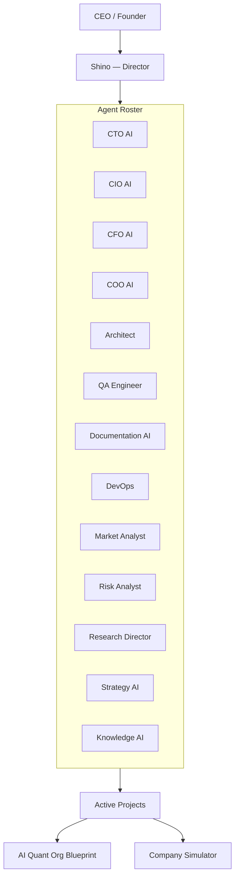
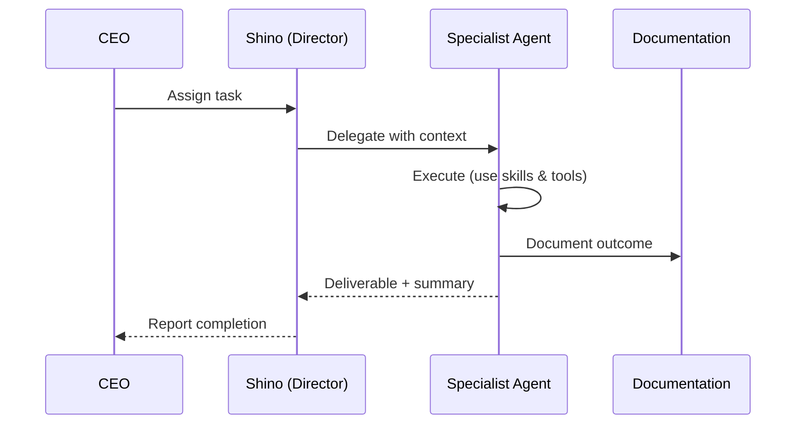

# 🏢 BagIdeaOffice — Multi-Agent AI Office System

> **An autonomous AI-powered office where specialized agents collaborate on research, strategy, engineering, and operations — directed by a single CEO.**

BagIdeaOffice is not a traditional application. It is a **collaborative AI workspace** — a living office of specialized AI agents, each with distinct roles, skills, and tools. They work together on projects spanning quantitative finance, software architecture, market research, risk analysis, and more.

---

## Table of Contents

1. [Philosophy](#-philosophy)
2. [Architecture](#-architecture)
3. [Agent Roster](#-agent-roster)
4. [Projects](#-projects)
5. [Skills & Tools](#-skills--tools)
6. [Workflow](#-workflow)
7. [Getting Started](#-getting-started)
8. [Documentation Map](#-documentation-map)
9. [License](#-license)

---

## 🧭 Philosophy

BagIdeaOffice is built on a few core beliefs:

| Principle | Why it matters |
|-----------|----------------|
| **Specialization** | Each agent has a focused role (CTO, QA, Market Analyst, etc.) — depth over breadth. |
| **Autonomy** | Agents execute their work independently and escalate only when blocked. |
| **Documentation-first** | No feature or decision is complete until it is documented. |
| **Traceability** | Every decision, ADR, and architecture choice is recorded and linkable. |
| **Parallel execution** | Agents can clone themselves to fan out across independent work items. |

---

## 🏛️ Architecture

### Key Concepts

- **Director (Shino)** — The CEO's second-in-command. Routes tasks to the best-suited agent, sets priorities, and keeps work moving.
- **Agents** — Each agent has a role, a set of skills, available tools, and persistent memory.
- **Skills** — Reusable capabilities (archive-search, deep-research, code-review, diagram-maker, etc.) that agents can be equipped with.
- **Projects** — Named workstreams with their own documentation and deliverables.

### Data Flow

---

## 👥 Agent Roster

| Agent | Role | Model | Key Skills |
|-------|------|-------|------------|
| **Shino** (main) | Director | DeepSeek V4 Flash | Office ops, Plugin builder, Project kickoff, Web automation |
| **CTO AI** (cto-ai) | Chief Technology Officer | Claude Sonnet 5 | Code review, Architecture, Plugin builder, Diagram maker |
| **CIO AI** (cio-ai) | Chief Investment Officer | Claude Sonnet 5 | Research, Strategy, Data analysis |
| **CFO AI** (cfo-ai) | Chief Financial Officer | Gemini 3.5 Flash | Office ops, Budget planning |
| **COO AI** (coo-ai) | Chief Operating Officer | Gemini 3.5 Flash | Workflow management, Project kickoff |
| **Architect** | System Architect | — | Code review, Diagram maker, Plugin builder |
| **QA Engineer** (qa) | Quality Assurance | — | Code review, Debug detective, Testing standards |
| **Documentation AI** | Technical Writer | — | Doc writer, Diagram maker, Archive search |
| **DevOps** (devops) | Infrastructure & CI/CD | — | Plugin builder, Code review, Project kickoff |
| **Market Analyst** | Market Research | — | Deep research, Data analysis |
| **Risk Analyst** | Risk Management | — | Code review, Data wrangling, Risk framework |
| **Research Director** | Lead Researcher | — | Deep research, Diagram maker, Data wrangling |
| **Strategy AI** | Strategic Planning | — | Deep research, Data wrangling, Market analysis |
| **Knowledge AI** | Knowledge Management | — | Archive search, Doc writer, Wiki management |
| **BID** | Office Operator | DeepSeek V4 Flash | Office control, Automation |

> **Note:** Agents are defined in [`registry.json`](registry.json). Skill-to-agent mappings live in per-agent `.claude/skills/.synced.json` files.

---

## 📂 Projects

### 🏭 AI Quant Org Blueprint

> **Goal:** Design a **World-Class Autonomous Quant Investment Operating System (AQOS)** — an AI-powered quant trading firm.

| Artifact | Description |
|----------|-------------|
| [01 — Org Structure](projects/ai-quant-org-blueprint/analysis/01-org-structure.md) | Role analysis, department structure, headcount planning, hiring roadmap |
| [02 — Technology Providers](projects/ai-quant-org-blueprint/analysis/02-technology-providers.md) | LLM providers, databases, cloud infra, GPU providers |
| [03 — Complete Blueprint](projects/ai-quant-org-blueprint/analysis/03-complete-blueprint.md) | Full system architecture — org, tech stack, data flow, governance |
| [Technology Decision Log](projects/ai-quant-org-blueprint/analysis/technology-decision-log.md) | 30-category tech decisions with rationale and fallbacks |

### 🏭 Company Simulator

> **Goal:** Standard Operating Procedures and Workflow definitions for the office itself.

| Artifact | Description |
|----------|-------------|
| [SOP](projects/company-simulator/sop.md) | Office SOPs — receiving orders, executing tasks, escalation |
| [Workflow](projects/company-simulator/workflow.md) | CEO → Assignment → Execution → Review → Complete pipeline |
| [System Architecture](projects/company-simulator/architecture.md) | AI Office Core — services, data flow, deployment |
| [Tech Stack](projects/company-simulator/tech-stack.md) | FastAPI / PostgreSQL / Redis / NATS / Qdrant / LiteLLM |
| [Risk Framework](projects/company-simulator/risk-framework.md) | Risk criteria, safe mode triggers, escalation L1-L5 |
| [Architecture Review](projects/company-simulator/architecture-review.md) | Modularity, plugin architecture, governance standards |
| [Budget Plan](projects/company-simulator/budget-plan.md) | API/VPS/GPU cost breakdown, 12-month projection |

---

## 🛠️ Skills & Tools

### Available Skills

| Skill | Description |
|-------|-------------|
| **archive-search** | Search historical memory, meetings, and documents |
| **code-review** | Review diffs for correctness, reuse, and efficiency |
| **data-wrangler** | Structured data manipulation and analysis |
| **debug-detective** | Root-cause analysis and debugging |
| **deep-research** | Multi-source research with adversarial verification |
| **diagram-maker** | Mermaid-based system and flow diagrams |
| **doc-writer** | Clean, skimmable markdown deliverables |
| **file-media-toolkit** | PDF, Office, video, audio, and image handling |
| **office-ops** | Office administration and coordination |
| **plugin-builder** | Build, deploy, and update office plugins |
| **project-kickoff** | Stand up new projects within the office |
| **web-automation** | Browser-driven testing and interaction |

### Agent Tools

Agents have access to tools including: **Read**, **Write**, **Edit**, **Bash**, **WebSearch**, **WebFetch**, **Glob**, **Grep**, **NotebookEdit**, **Agent**, **Skill**, and more — scoped per agent by their security profile.

---

## 🔄 Workflow

Work follows a structured pipeline:

**Priority levels:**

| Priority | Service Level |
|----------|---------------|
| 🚨 Urgent | Start within 15 min |
| 🔴 High | Start within 2 hr |
| 🟡 Medium | Start within 24 hr |
| 🟢 Low | Next cycle |

See the full [Workflow](projects/company-simulator/workflow.md) document for details.

---

## 🚀 Getting Started

### 1. Understand the Office

Start by reading the shared office bulletin board:
- [`OFFICE.md`](OFFICE.md) — Shared office knowledge
- [`notes.md`](notes.md) — Active notes and status updates
- [`registry.json`](registry.json) — Agent definitions and configuration

### 2. Browse the Documentation

See the [Documentation Map](docs/index.md) for a full index of every document in the office.

### 3. Follow the Standards

All documentation, code, and QA work must follow the office standards:

- [Documentation Standards](agents/documentation/documentation-standards.md) — Doc templates, metadata, naming conventions
- [QA Standards](agents/qa/qa-standards.md) — Testing standards, review checklists, Definition of Done
- [Architecture Review Standards](projects/company-simulator/architecture-review.md) — Modularity & plugin governance

### 4. Start a Task

Tasks flow through the pipeline: describe the requirement, and Shino (the Director) routes it to the right agent. All tasks are tracked and require a review pass before closure.

### 5. Write Memory

Cross-session context is stored in [`memory/`](memory/) files. Write what matters — agent preferences, project constraints, decisions that aren't obvious from the code.

---

## 🗺️ Documentation Map

| Section | Document | Description |
|---------|----------|-------------|
| **Central** | [Office Wiki Index](company-wiki-index.md) | Full directory of every document in the office |
| **Central** | [OFFICE.md](OFFICE.md) | Shared office knowledge |
| **Central** | [Notes](notes.md) | Bulletin board (กระดานโน้ตกลาง) |
| **Standards** | [Documentation Standards](agents/documentation/documentation-standards.md) | Templates & conventions for all docs |
| **Standards** | [QA Standards](agents/qa/qa-standards.md) | Testing & review standards |
| **Reference** | [Agent Registry](registry.json) | All agents, roles, skills, models |
| **Reference** | [Market Data Sources](agents/market-analyst/market-data-sources.md) | Free APIs for financial data |

For the full navigable index, see the [Documentation Map](docs/index.md) and the [Company Wiki Index](company-wiki-index.md).

---

## 📄 License

Proprietary — BagIdeaOffice. All rights reserved.

---

> 💡 **New here?** Start with the [Documentation Map](docs/index.md) and the [Documentation Standards](agents/documentation/documentation-standards.md). Every feature needs docs.
