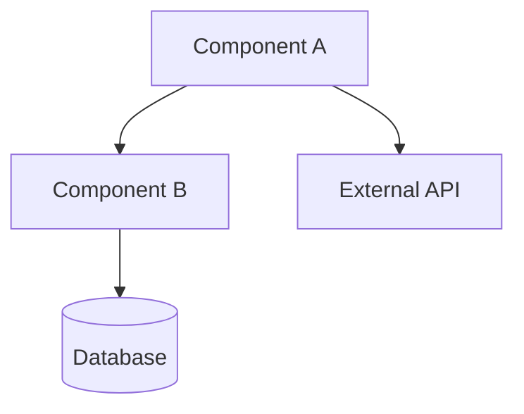
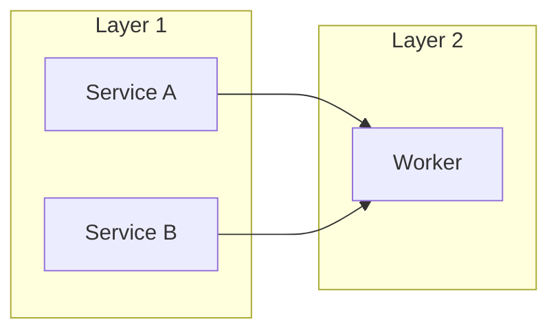
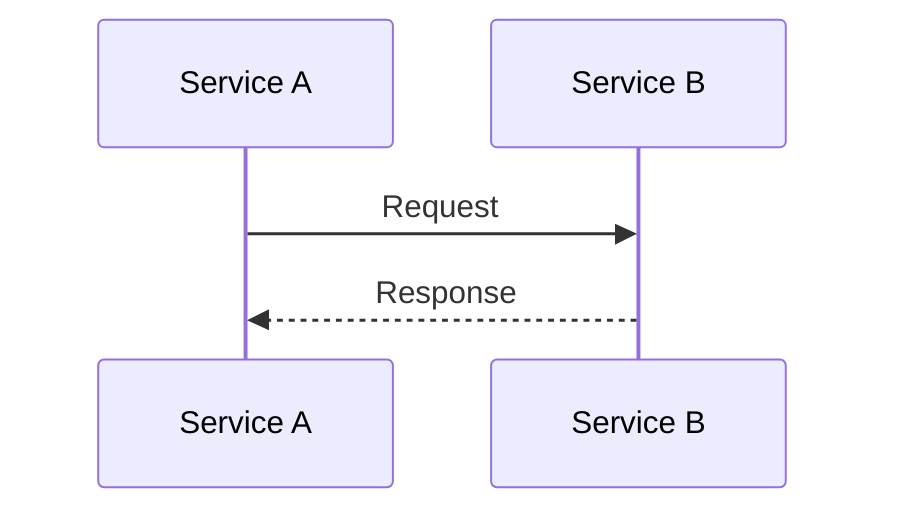
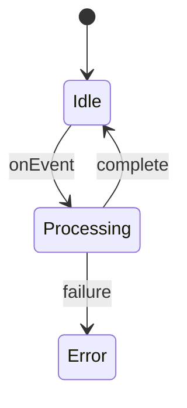

# 📐 Documentation Standards — BagIdeaOffice

> **Purpose:** This document defines the templates and conventions for all documentation produced in the office. Every feature, decision, and process needs docs — no undocumented work is complete.
>
> **Scope:** Architecture docs, research reports, SOPs, changelogs, and API references.
>
> **Language:** English for all formal docs. Thai or mixed languages allowed in internal notes and office memory when context calls for it.

---

## Table of Contents

1. [General Principles](#1-general-principles)
2. [Document Metadata](#2-document-metadata)
3. [Architecture Documentation](#3-architecture-documentation)
   - 3.1 System Architecture Overview
   - 3.2 Architecture Decision Record (ADR)
   - 3.3 Component Spec
4. [Research Reports](#4-research-reports)
   - 4.1 Exploratory Research
   - 4.2 Deep Research Report
5. [Standard Operating Procedures (SOP)](#5-standard-operating-procedures-sop)
6. [Changelog / Release Notes](#6-changelog--release-notes)
7. [API Reference](#7-api-reference)
8. [File Naming & Organization](#8-file-naming--organization)

---

## 1. General Principles

| Principle | Explanation |
|-----------|-------------|
| **One file, one focus** | Each doc covers a single coherent topic. Split when sections feel crowded. |
| **Frontmatter always** | Every doc starts with YAML frontmatter (see [§2](#2-document-metadata)). |
| **Title + TOC** | H1 title, then a table of contents for anything over ~50 lines. |
| **Link, don't repeat** | Use `[[memory-name]]` or relative `(../path.md)` links. Duplication rots. |
| **Audience first** | Write for the intended reader: dev, PM, ops, or future you. |
| **Diagrams in Mermaid** | All architecture and flow diagrams use Mermaid syntax so they stay in-source and versionable. |
| **Date-stamp decisions** | Every ADR and research finding includes the date. Context expires. |

---

## 2. Document Metadata

Every document **must** begin with YAML frontmatter:

```yaml
---
title: <Title Case — Human Readable Name>
status: draft | review | approved | deprecated
date: <YYYY-MM-DD>
author: <Name or Agent-ID>
tags:
  - <tag>
  - <tag>
references:
  - <linked-doc.md>
  - <url>
---
```

**Guidelines:**
- `status`: Start at `draft`. Move to `review` when ready for feedback, `approved` when signed off, `deprecated` when superseded.
- `date`: The last-updated date. For living documents, keep this current.
- `author`: Who wrote it. For collaborative docs, use the primary author.
- `tags`: 2–5 keywords for discoverability.
- `references`: Links to related docs, ADRs, issues, or external resources.

---

## 3. Architecture Documentation

### 3.1 System Architecture Overview

Used for: documenting a system, subsystem, or integration point.

```markdown
---
title: <System Name> — Architecture Overview
status: draft
date: <YYYY-MM-DD>
author: <Name>
tags:
  - architecture
  - <system>
references:
  - <ADR-xxx.md>
---

# <System Name> — Architecture Overview

## Context
_What problem does this system solve? Who uses it? Why does it exist?_

## Goals & Non-Goals
- **Goals:** <list of primary objectives>
- **Non-Goals:** <what is explicitly out of scope>

## Architecture

### High-Level Diagram



### Component Diagram



### Data Flow
_Describe the primary data flow through the system, step by step._

1. ...
2. ...

## Key Decisions
_Link to ADRs for each significant architectural choice._

| Decision | ADR |
|----------|-----|
| Why X? | [ADR-001](adr-001.md) |
| Why Y? | [ADR-002](adr-002.md) |

## Constraints
- _Technology constraints_
- _Business constraints_

## Deployment
_How is this deployed? What infrastructure does it run on?_

## Related
- [[memory-name]] — _what this memory says about the system_
```

---

### 3.2 Architecture Decision Record (ADR)

Used for: recording a single architectural decision and its rationale.

```markdown
---
title: ADR-<NNN>: <Decision Title>
status: proposed | accepted | deprecated | superseded
date: <YYYY-MM-DD>
author: <Name>
tags:
  - adr
references:
  - <related-adr.md>
superseded-by: <ADR-NNN> (if applicable)
---

# ADR-<NNN>: <Decision Title>

## Context
_What is the issue motivating this decision? What forces are at play?_

## Decision
_What is the change that we're proposing or doing?_

## Rationale
_Why is this the best choice? What alternatives were considered and rejected?_

### Alternatives Considered

| Alternative | Reason Rejected |
|-------------|-----------------|
| Option A | ... |
| Option B | ... |

## Consequences
_What becomes easier or harder? What trade-offs are accepted?_

## Diagram (if applicable)



## Related
- [ADR-NNN](adr-NNN.md) — _related decision_
```

---

### 3.3 Component Spec

Used for: detailed specification of a single component, service, or module.

```markdown
---
title: <Component Name> — Spec
status: draft
date: <YYYY-MM-DD>
author: <Name>
tags:
  - component
  - spec
references:
  - <architecture-overview.md>
---

# <Component Name> — Spec

## Purpose
_One paragraph on what this component does._

## Interface

### Inputs
| Name | Type | Description |
|------|------|-------------|
| ... | ... | ... |

### Outputs
| Name | Type | Description |
|------|------|-------------|

## Behavior
_Describe state machine, lifecycle, or key algorithms._



## Dependencies
- Internal: <component names>
- External: <API names, libraries>

## Configuration
| Key | Default | Description |
|-----|---------|-------------|
| ... | ... | ... |

## Error Handling
_What errors can occur? How are they surfaced?_
```

---

## 4. Research Reports

### 4.1 Exploratory Research

Used for: quick investigation of a topic, tool, or approach (1–2 session scope).

```markdown
---
title: <Topic> — Exploratory Research
status: draft
date: <YYYY-MM-DD>
author: <Name>
tags:
  - research
  - exploration
references:
  - <url>
---

# <Topic> — Exploratory Research

## Question
_What were we trying to learn?_

## Method
_How was this investigated? (Web search, code audit, experiment, etc.)_

## Findings
_Key discoveries, grouped by theme._

### Finding 1: <title>
<details>

### Finding 2: <title>
<details>

## Conclusion
_What did we learn? What should we do next?_

## Next Steps
- [ ] Action Item 1
- [ ] Action Item 2

## Sources
- [Title](url) — _why this source was used_
```

---

### 4.2 Deep Research Report

Used for: thorough, multi-source investigation with adversarial verification.

```markdown
---
title: <Topic> — Deep Research Report
status: draft
date: <YYYY-MM-DD>
author: <Name>
tags:
  - research
  - deep-dive
references:
  - <related-adr.md>
---

# <Topic> — Deep Research Report

## Executive Summary
_3–5 sentences: the question, the method, the answer, and the confidence level._

## Research Question
_What exactly was investigated? Why does it matter?_

## Methodology
_How was the research conducted? What sources were consulted? Was adversarial verification used?_

## Findings

### 1. <Finding Title>
_Detailed finding with evidence._

**Sources:** [Title](url)

### 2. <Finding Title>
_Detailed finding with evidence._

**Sources:** [Title](url)

## Analysis
_Cross-cutting patterns, contradictions, and insights across findings._

## Adversarial Review
_What counter-arguments were considered? What would change the conclusion?_

## Recommendations
_Prioritized, actionable recommendations._

| # | Recommendation | Confidence | Effort |
|---|---------------|------------|--------|
| 1 | ... | High/Med/Low | S/M/L |

## Open Questions
- _What remains unknown?_

## Sources
_All sources cited, with URLs and brief notes on authority/relevance._

---

## 5. Standard Operating Procedures (SOP)

Used for: repeatable processes that team members or agents follow.

```markdown
---
title: <Process Name> — Standard Operating Procedure
status: draft
date: <YYYY-MM-DD>
author: <Name>
tags:
  - sop
  - operations
references:
  - <related-sop.md>
---

# <Process Name> — Standard Operating Procedure

## Objective
_What does this procedure accomplish? When should it be used?_

## Prerequisites
- _Access needed_
- _Tools needed_
- _Permissions needed_

## Procedure

### Step 1: <Title>
_Action to take, with expected result._

```bash
# Example command, if applicable
```

### Step 2: <Title>
...

### Step N: Verification
_How to confirm the procedure completed successfully._

## Troubleshooting

| Problem | Likely Cause | Solution |
|---------|-------------|----------|
| ... | ... | ... |

## Related
- [[memory-name]]
```

---

## 6. Changelog / Release Notes

Used for: announcing changes between versions.

```markdown
---
title: v<X.Y.Z> — <Version Name>
status: approved
date: <YYYY-MM-DD>
author: <Name>
tags:
  - changelog
  - release
references:
  - <milestone-or-issue-tracker>
---

# v<X.Y.Z> — <Version Name>

## Overview
_One paragraph on what this release is about._

## Breaking Changes
- <Change> — _migration instructions or link to migration guide_

## Features
- <Feature> — _brief description_

## Bug Fixes
- <Bug> — _brief description_

## Performance
- <Improvement> — _metrics if available_

## Documentation
- <Doc change>

## Full Changelog
_Link to commit range or PR list._
```

---

## 7. API Reference

Used for: documenting HTTP APIs, function libraries, or tool interfaces.

```markdown
---
title: <API Name> — API Reference
status: draft
date: <YYYY-MM-DD>
author: <Name>
tags:
  - api
  - reference
references:
  - <architecture-overview.md>
---

# <API Name> — API Reference

## Base URL
`<scheme>://<host>/<base-path>`

## Authentication
_How to authenticate (API key, Bearer token, OAuth, etc.)_

## Endpoints

### `<METHOD> /<path>`

**Description:** _What does this endpoint do?_

**Request:**

| Parameter | Type | Required | Description |
|-----------|------|----------|-------------|
| ... | ... | yes/no | ... |

**Request Example:**

```json
{
  "key": "value"
}
```

**Response `200`:**

```json
{
  "status": "ok"
}
```

**Error Responses:**

| Code | Meaning |
|------|---------|
| 400 | ... |
| 401 | ... |
| 404 | ... |

## Rate Limiting
_If applicable._

---

## 8. File Naming & Organization

### Convention

```
<nnn>-<kebab-case-slug>.md
```

- Use two- or three-digit prefixes for sequenced docs (ADRs, SOPs).
- Use descriptive kebab-case for standalone docs.
- No spaces or underscores in filenames.

### Directory Structure

```
docs/
├── architecture/
│   ├── 001-system-overview.md
│   ├── adr-001-auth-strategy.md
│   └── adr-002-database-choice.md
├── research/
│   ├── exploratory/
│   └── deep-reports/
├── sop/
│   ├── 001-deploy-process.md
│   └── 002-incident-response.md
├── api/
│   └── service-name.md
├── changelogs/
│   └── v0.9.38.md
└── index.md           (optional: map of docs)
```

### Cross-Referencing

- **Within the same repo:** `[Title](path/file.md)`
- **To office memory:** `[[memory-name]]`
- **To external URLs:** `[Title](url)`

---

## Template Quick-Reference

| Template | File | When to Use |
|----------|------|-------------|
| System Architecture | `docs/architecture/<nnn>-<system>-overview.md` | New system or major refactor |
| ADR | `docs/architecture/adr-<nnn>-<title>.md` | Each architectural decision |
| Component Spec | `docs/architecture/<component>-spec.md` | New component or service |
| Exploratory Research | `docs/research/exploratory/<topic>.md` | Quick investigation (<1 day) |
| Deep Research | `docs/research/deep-reports/<topic>.md` | Multi-source investigation |
| SOP | `docs/sop/<nnn>-<process>.md` | Repeatable process |
| Changelog | `docs/changelogs/v<version>.md` | Each release |
| API Reference | `docs/api/<service>.md` | Each service or API surface |
