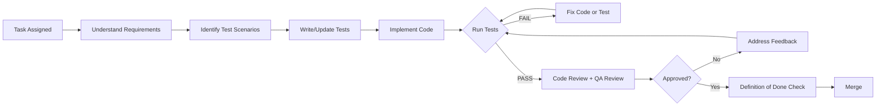
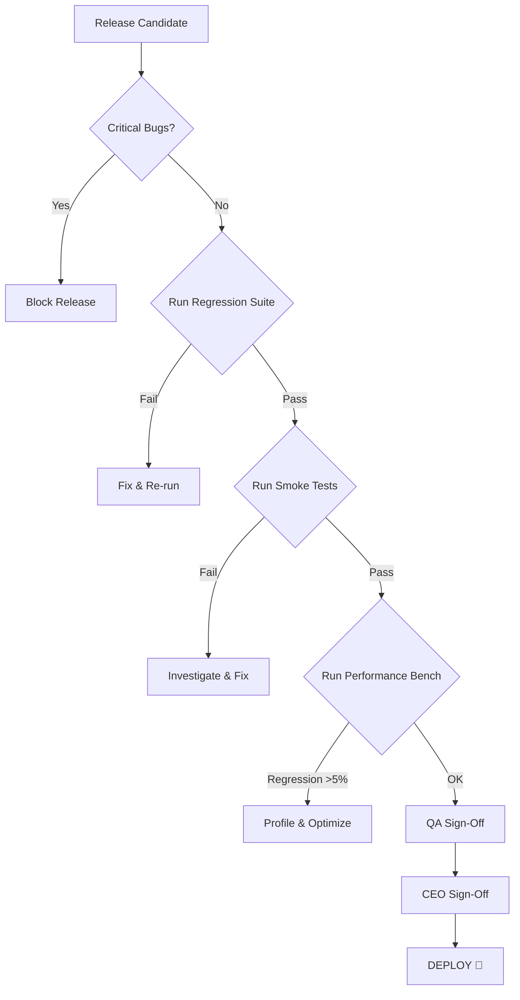

# QA Standards — Office-Wide Testing & Quality Guidelines

> **Version:** 1.0  
> **Owner:** QA Engineer  
> **Scope:** ทุกโปรเจคในออฟฟิศ (company-simulator, ai-quant-org-blueprint, และอื่นๆ)  
> **หลักการ:** No deploy without passing all tests.

---

## สารบัญ

1. [Core Principles](#1-core-principles)
2. [QA Process](#2-qa-process)
3. [Review Checklist](#3-review-checklist)
4. [Testing Standards](#4-testing-standards)
5. [Definition of Done (DoD)](#5-definition-of-done-dod)
6. [Test Pyramid & Strategy](#6-test-pyramid--strategy)
7. [Automation Standards](#7-automation-standards)
8. [Bug Triage & Severity](#8-bug-triage--severity)
9. [Release Gate](#9-release-gate)
10. [Edge Cases & Non-Functional Testing](#10-edge-cases--non-functional-testing)

---

## 1. Core Principles

| # | Principle | What it means |
|---|-----------|---------------|
| 1 | **Test first, code second** | เขียน test ก่อน หรืออย่างช้าพร้อม code — ไม่มีวัน "เดี๋ยวกลับมาเขียนทีหลัง" |
| 2 | **No deploy without tests** | CI/CD pipeline ทุกตัวต้องผ่าน test suite ก่อนถึง production |
| 3 | **Fail fast, fail loud** | Test ล้มเหลวต้องรายงานทันที ไม่เงียบ ไม่ข้าม ไม่ skip โดยไม่มีเหตุผล |
| 4 | **Reproducible by design** | ทุก test ต้อง deterministic — run กี่ครั้งก็ได้ผลเหมือนเดิม |
| 5 | **Coverage ≠ Quality** | 100% coverage ไม่ได้แปลว่าปลอดภัย — เน้น testing ที่มีคุณค่าจริง |
| 6 | **Every bug is a test gap** | ทุก defect ที่เจอ = ต้องมี test ใหม่ป้องกัน regression |

---

## 2. QA Process

### 2.1 Per-Task Workflow



### 2.2 Roles & Responsibilities

| Role | Responsibility |
|------|---------------|
| **Developer** | เขียน unit/integration tests, self-review, fix bugs |
| **QA Engineer** | review test coverage, ออกแบบ E2E/acceptance tests, regression suite |
| **Reviewer** | review logic + test quality, ตรวจ boundary/edge cases |
| **CEO/Owner** | Final sign-off ก่อน production release |

### 2.3 Test Phase Timeline

| Phase | When | Who | Output |
|-------|------|-----|--------|
| Test Design | ก่อนเขียน code | QA + Dev | Test scenarios, test cases |
| Unit Tests | ระหว่าง/หลัง implement | Dev | ✅ Unit tests pass |
| Integration Tests | หลัง unit tests ผ่าน | Dev + QA | ✅ Integration tests pass |
| Code Review | ก่อน merge | Reviewer | ✅ Reviewed (incl. tests) |
| QA Review | หลัง merge → staging | QA | ✅ QA sign-off |
| E2E / Smoke | ก่อน release | QA | ✅ E2E pass |
| Regression | ก่อน release | Auto | ✅ Regression suite pass |

---

## 3. Review Checklist

ทุก Pull Request / Merge Request **ต้อง** ผ่าน checklist นี้ก่อน approve:

### 3.1 Code Review Checklist

- [ ] **Functional correctness** — โค้ดทำสิ่งที่ requirements ระบุหรือไม่?
- [ ] **Edge cases handled** — null, empty, max values, wrong types?
- [ ] **Error handling** — try/catch, error messages, fallback behavior?
- [ ] **Side effects** — การเปลี่ยนแปลงมีผลกระทบต่อส่วนอื่นในระบบไหม?
- [ ] **Logging** — มี log พอที่จะ debug ปัญหาใน production ได้?
- [ ] **Security** — input validation, auth checks, injection prevention?
- [ ] **Performance** — N+1 query? memory leak? unnecessary re-render?
- [ ] **Backward compatibility** — schema/API changes ต้อง migrate ได้ไม่มี break?
- [ ] **Concurrency / race conditions** — ถ้ามี async/parallel operations?
- [ ] **Dependencies** — dependency ใหม่จำเป็นจริงไหม? version conflict?

### 3.2 Test Review Checklist

- [ ] **Test coverage** — ทุก code path ที่เปลี่ยนมี test ครอบคลุม?
- [ ] **Positive & negative cases** — both happy path and error path?
- [ ] **Boundary values** — min, max, just-below, just-above?
- [ ] **No flaky tests** — test deterministic? ไม่ depend on timing/order?
- [ ] **Test isolation** — แต่ละ test ทำงานแยกกัน ไม่แชร์ state?
- [ ] **Readable assertions** — error message ชัดเจนเมื่อ test fail?
- [ ] **Mocking** — mock เฉพาะ external dependencies, ไม่ over-mock?
- [ ] **Test data cleanup** — cleanup หลัง test เสร็จ?
- [ ] **No test pollution** — test หนึ่งไม่ทำให้อีก test ล้ม?
- [ ] **Test speed** — unit tests เร็ว (< 100ms ต่อ test)?

### 3.3 QA Review Checklist (ก่อน sign-off)

- [ ] **Scenarios match requirements** — ทุก acceptance criteria มี test?
- [ ] **Regression impact assessed** — เปลี่ยนอะไรที่อาจพังของเก่า?
- [ ] **UI/UX consistency** (ถ้ามี UI) — ตรงกับ design spec?
- [ ] **Accessibility** (ถ้า relevant) — keyboard nav, screen reader, contrast?
- [ ] **Localization** (ถ้ามี) — strings extractable, no hardcoded text?
- [ ] **Configurability** — feature flags, env vars, config files documented?
- [ ] **Documentation updated** — README, API docs, changelog?

---

## 4. Testing Standards

### 4.1 Test Naming Convention

```
<unit>_should_<expected>_when_<condition>
# หรือ
Test<Component><Scenario><ExpectedBehavior>
```

**ตัวอย่าง:**
```python
# Good
def test_calculator_should_return_sum_when_adding_two_numbers():
def test_cart_should_raise_error_when_adding_duplicate_item():

# Bad
def test_add():
def test_cart():
```

### 4.2 Test Structure: AAA Pattern

ทุก test ต้องมี 3 ส่วนชัดเจน:

```python
def test_order_should_calculate_total_with_tax():
    # Arrange — setup data
    order = Order(items=[Item(100), Item(200)])
    
    # Act — execute what we're testing
    total = order.calculate_total()
    
    # Assert — verify the result
    assert total == 330   # 300 + 10% tax
```

### 4.3 Test Isolation Rules

- ✅ แต่ละ test ต้องทำ cleanup เอง (teardown, reset state)
- ✅ ห้าม test  depende กัน (test A ต้องรันได้ถ้าไม่มี test B)
- ✅ ใช้ fresh data ทุกครั้ง — ไม่ reuse object ข้าม test
- ✅ Database tests: transaction rollback หรือ cleanup หลัง test
- ❌ ห้ามใช้ global/shared mutable state ใน test
- ❌ ห้าม test สั่งเงื่อนไขจาก test อื่น

### 4.4 What to Test (Priority Order)

| Priority | What | Example |
|----------|------|---------|
| 🔴 P0 | Core business logic | การคำนวณราคา, workflow สำคัญ, auth |
| 🟠 P1 | Integration points | API endpoints, database queries, external services |
| 🟡 P2 | Edge cases & boundaries | empty, null, overflow, timeout, network error |
| 🟢 P3 | UI rendering | component renders correctly, states (loading/empty/error) |
| 🔵 P4 | Accessibility | keyboard navigation, screen reader, color contrast |

### 4.5 What NOT to Test

- 🔇 Third-party library internals (ถ้า library มี test ของมันแล้ว)
- 🔇 Simple getters/setters (ไม่มี logic)
- 🔇 Generated code (อย่าแก้ด้วย — ควรรีเจ็น)
- 🔇 Config files / constants (ถ้าไม่มี logic condition)
- 🔇 Visual layout pixel-perfect (ใช้ snapshot sparingly)

---

## 5. Definition of Done (DoD)

### 5.1 Feature-Level DoD

ทุก feature/story **ต้อง** ผ่านทั้งหมดนี้ก่อนนับว่า "Done":

- [ ] **Code implemented** และ compiles/passes lint
- [ ] **Unit tests written** — cover อย่างน้อย business logic
- [ ] **Integration tests written** — API/database/payment flow
- [ ] **All tests pass** — local + CI (green build)
- [ ] **Test coverage ≥ 70%** (new code) — แกะเว้นเฉพาะที่ QA เห็นชอบ
- [ ] **Code reviewed** — reviewer approved (code + tests)
- [ ] **QA reviewed** — scenarios ตรง requirements ไม่มี gap
- [ ] **No critical/high bugs open** (ดู severity ใน Section 8)
- [ ] **Documentation updated** — README / API docs / changelog
- [ ] **Edge cases documented** (ถ้ารู้) — ใน test หรือ in-code comment

### 5.2 Release-Level DoD

ก่อน release **ทุกครั้ง**:

- [ ] Regression suite run — **100% pass**
- [ ] Smoke test run (production-like) — **pass**
- [ ] Performance benchmark — **no regression** (>5% slower = investigate)
- [ ] All P0/P1 bugs closed
- [ ] Changelog updated
- [ ] Version bumped (semver)
- [ ] Rollback plan exists

### 5.3 Hotfix-Level DoD

สำหรับ hotfix (push ด่วน):

- [ ] Minimal code change (เฉพาะ fix)
- [ ] One test that reproduces the bug (red → green)
- [ ] QA reviewed (อย่างน้อย async)
- [ ] Rollback plan explicit

---

## 6. Test Pyramid & Strategy

```
         ╱╲
        ╱ E2E ╲           ← 5-10% (หน้าจอ user, critical path)
       ╱────────╲
      ╱Integration╲       ← 20-30% (API, DB, service-to-service)
     ╱──────────────╲
    ╱   Unit Tests    ╲    ← 60-75% (logic, components, utils)
   ╱────────────────────╲
```

### 6.1 Unit Tests (ฐานปิรามิด)

- **เป้าหมาย:** verify logic ทีละหน่วย
- **ลักษณะ:** ไม่มี I/O, mock external dependencies, รันใน ms
- **เครื่องมือ:** pytest, vitest, jest, unittest
- **สัดส่วน:** ~60-75% ของ test ทั้งหมด

### 6.2 Integration Tests (กลางปิรามิด)

- **เป้าหมาย:** verify การทำงานร่วมกันของหลาย component
- **ลักษณะ:** อาจ读写 database, เรียก real API, ใช้ real filesystem
- **เครื่องมือ:** supertest, pytest with fixtures, testcontainers
- **สัดส่วน:** ~20-30% ของ test ทั้งหมด

### 6.3 E2E / Acceptance Tests (ยอดปิรามิด)

- **เป้าหมาย:** verify user journey ทั้งเส้น
- **ลักษณะ:** browser automation, real service calls
- **เครื่องมือ:** Playwright, Cypress, Selenium
- **สัดส่วน:** ~5-10% ของ test ทั้งหมด
- **ข้อควรระวัง:** ช้าและ fragile — เลือกเฉพาะ critical path

---

## 7. Automation Standards

### 7.1 CI/CD Requirements

ทุกโปรเจคต้องมี CI pipeline ที่:

- ✅ Run lint + format check
- ✅ Run unit tests (ทุก commit)
- ✅ Run integration tests (ทุก PR)
- ✅ Run E2E tests (ก่อน merge to main)
- ✅ Report coverage (threshold fail ถ้าต่ำกว่าเกณฑ์)
- ❌ ไม่ allow merge ถ้า CI fail

### 7.2 Coverage Thresholds (Minimum)

| Layer | Minimum | Stretch |
|-------|---------|---------|
| New code (feature) | 70% | 85% |
| Business logic | 80% | 95% |
| API endpoints | 75% | 90% |
| UI components | 60% | 80% |
| Overall project | 60% | 75% |

### 7.3 Flaky Test Policy

- **0 tolerance:** Flaky test = immediate fix หรือ remove
- ถ้าเจอ flaky test: file ticket, freeze PR จนกว่าจะ fix
- ห้าม `@Flaky` / `@skip` โดยไม่มี ticket reference
- ถ้า flaky > 14 วัน → ลบ test นั้น (มันไม่ได้ protect อะไร)

### 7.4 Test Data Management

- **Test fixtures:** ใช้ factory/faker สร้าง data เสมอ — ห้าม hardcode ใน test
- **Secrets:** ใช้ env var หรือ secret store — ห้าม hardcode
- **Database:** แต่ละ test ใช้ transaction rollback หรือ clean DB
- **External services:** mock หรือ testcontainers — ห้าม depend on real production

---

## 8. Bug Triage & Severity

### 8.1 Severity Levels

| Level | Label | Definition | Response Time |
|-------|-------|------------|---------------|
| 🔴 **Critical (P0)** | `severity/critical` | System down, data loss, security breach | Fix immediately (≤ 4h) |
| 🟠 **High (P1)** | `severity/high` | Major feature broken, no workaround | Fix within 24h |
| 🟡 **Medium (P2)** | `severity/medium` | Feature partially broken, has workaround | Fix before next release |
| 🟢 **Low (P3)** | `severity/low` | Cosmetic, minor, nice-to-have | Fix when time allows |

### 8.2 Bug Report Template

```
## Bug Report

**Summary:** [สั้น ครบถ้วน — อ่านแล้วรู้ทันทีว่า bug คืออะไร]

**Severity:** P0 / P1 / P2 / P3

**Environment:**
- OS: [Windows/Mac/Linux]
- Browser/Version: [Chrome 120 / Node 20 / ...]
- Commit/Version: [abc1234 / v1.2.3]

**Steps to Reproduce:**
1. Go to '...'
2. Click on '....'
3. Scroll down to '....'
4. See error

**Expected behavior:** [อะไรควรจะเกิดขึ้น]

**Actual behavior:** [อะไรที่เกิดขึ้นจริง]

**Test that should have caught this:** [ข้อเสนอ — ควรมี test อะไรป้องกัน]

**Logs/Screenshots:** [ถ้ามี]
```

### 8.3 Bug Lifecycle

```
Found → Triaged → Assigned → Fixed → Verified → Closed
                                       ↓
                                  (ถ้า verify fail → Reopen)
```

---

## 9. Release Gate

ทุก release ต้องผ่าน gate นี้ก่อน deploy:

### 9.1 Pre-Release Checklist



### 9.2 Rollback Criteria

Deploy → rollback ทันทีถ้า:

- ❌ Test coverage ต่ำกว่า minimum threshold
- ❌ Monitoring alert spikes (error rate > 1%, latency > 500ms)
- ❌ Critical bug found in production
- ❌ Data integrity issue suspected

---

## 10. Edge Cases & Non-Functional Testing

### 10.1 Edge Cases Checklist (ทุก feature)

- [ ] **Empty state** — ไม่มี data, รายการว่าง, ค้นหาไม่เจอ
- [ ] **Maximum input** — ตัวอักษรยาวสุด, รายการมากสุด, ขนาดไฟล์ใหญ่สุด
- [ ] **Minimum input** — ค่า 0, ค่าน้อยสุด, ตัวอักษรเดียว
- [ ] **Invalid input** — wrong type, negative numbers, SQL injection, XSS
- [ ] **Duplicate** — submit form ซ้ำ, add item ซ้ำ, create existing resource
- [ ] **Boundary crossing** — เปลี่ยนหน้าตอนกำลังโหลด,กด back ตอน submit
- [ ] **Network failure** — timeout, disconnect, retry behavior
- [ ] **Authorization** — ไม่มีสิทธิ์, token expire, role mismatch
- [ ] **Concurrent access** — user เดียวกัน login 2 ที่, race condition
- [ ] **Browser back/forward** (ถ้ามี UI) — navigation state ถูกต้อง?

### 10.2 Non-Functional Testing Checklist

| Type | When | Tools/Approach |
|------|------|---------------|
| **Performance** | ก่อน release | k6, ab, lighthouse — benchmark vs baseline |
| **Load** | ทุก major release | simulate expected peak traffic (2x normal) |
| **Security** | ทุก release | OWASP Top 10 scan, dependency audit |
| **Memory** | feature ใหม่ที่มี long-running process | check memory leak, GC behavior |
| **Concurrency** | async/multi-thread feature | race check, deadlock detection |
| **Recovery** | critical path | power fail, process kill, DB disconnect test |

---

## Appendix A: Quick Reference — สิ่งที่ QA อยากให้ทุกคนจำ

```
📌 เขียน test ก่อน code (หรืออย่างช้าพร้อมกัน)
📌 Test ต้อง deterministic — run กี่ครั้งก็เหมือนเดิม
📌 ไม่มีคำว่า "เดี๋ยวกลับมาเขียนทีหลัง"
📌 CI แดง = หยุดทุกอย่างก่อน
📌 Flaky test = immediate fix หรือ remove
📌 Bug ที่เจอ = ต้องมี test ใหม่ป้องกัน regression
📌 70% coverage ขั้นต่ำสำหรับ code ใหม่
📌 3 ส่วนของ test: Arrange → Act → Assert
📌 Edge case > Happy path (ในแง่ความสำคัญต่อ quality)
📌 No deploy without passing all tests!
```

---

## Appendix B: Test Environment Requirements

| Environment | Purpose | Data | Stability |
|-------------|---------|------|-----------|
| **Local** | Dev test, unit test | Mock/faker | Dev machine |
| **CI** | PR validation | Fresh DB | Ephemeral |
| **Staging** | Integration + E2E | Anonymized prod-like | Stable |
| **Production** | Smoke + monitoring | Real data | Always on |

---

## Appendix C: Links & Resources

- Office workspace: `C:\Users\johnw\AppData\Local\BagIdeaOffice\app\workspace\`
- QA agent workspace: `workspace\agents\qa\`
- Project root example: `workspace\projects\company-simulator\`
- Test directory convention: `<project-root>/tests/` (unit), `<project-root>/tests/integration/`, `<project-root>/tests/e2e/`

---

> **Final word:** Quality is not a phase. Quality is not a person.  
> Quality is a habit that everyone in the office practices every day.  
> No deploy without tests. 🛡️
