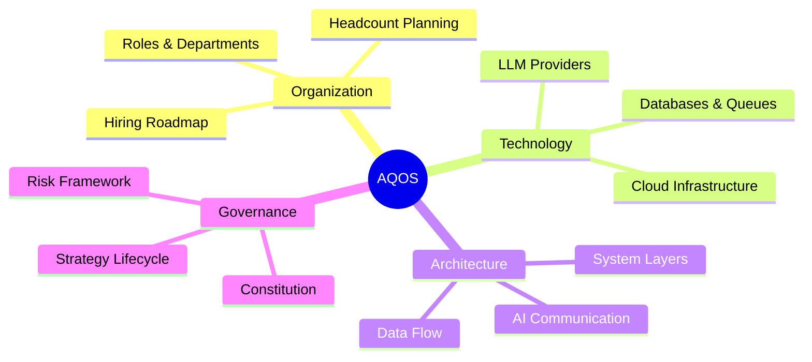

# 🗺️ BagIdeaOffice — Documentation Map

> **The central index for every document in the office. Find anything, fast.**

This index organizes all BagIdeaOffice documentation by category. Each entry links directly to the source file. For an alternative view, see the [Company Wiki Index](../company-wiki-index.md) maintained by Knowledge AI.

---

## Table of Contents

1. [Office Central](#office-central)
2. [Standards & Guidelines](#standards--guidelines)
3. [Agent Memory](#agent-memory)
4. [Architecture](#architecture)
5. [Projects — AI Quant Org Blueprint](#projects--ai-quant-org-blueprint)
6. [Projects — Company Simulator](#projects--company-simulator)
7. [Research & Analysis](#research--analysis)
8. [Skills Reference](#skills-reference)
9. [Quick Reference](#quick-reference)

---

## Office Central

| Document | Description | Path |
|----------|-------------|------|
| **Office Knowledge** | Shared office rules, owner info, cross-agent reference | [`OFFICE.md`](../OFFICE.md) |
| **Office Notes** | Bulletin board — agents leave updates for the CEO | [`notes.md`](../notes.md) |
| **Agent Registry** | All agents, roles, models, skills, and tools | [`registry.json`](../registry.json) |
| **Wiki Index** | Full navigable index by Knowledge AI | [`company-wiki-index.md`](../company-wiki-index.md) |
| **README** | Project overview — architecture, agents, projects, getting started | [`README.md`](../README.md) |
| **Contributing Guide** | Workflow, standards, escalation, and review process | [`CONTRIBUTING.md`](../CONTRIBUTING.md) |

---

## Standards & Guidelines

| Document | Author | Description | Path |
|----------|--------|-------------|------|
| **Documentation Standards** | Documentation AI | Templates for architecture docs, ADRs, research reports, SOPs, changelogs, API references | [`../agents/documentation/documentation-standards.md`](../agents/documentation/documentation-standards.md) |
| **QA Standards** | QA Engineer | Testing standards, review checklists, Definition of Done | [`../agents/qa/qa-standards.md`](../agents/qa/qa-standards.md) |
| **Architecture Review** | Architect | Modularity, plugin architecture, governance standards | [`../projects/company-simulator/architecture-review.md`](../projects/company-simulator/architecture-review.md) |

---

## Agent Memory

> Cross-session context files — each agent's persistent memory about the owner, projects, and preferences.

| Agent | Path |
|-------|------|
| Documentation AI | [`../memory/documentation.md`](../memory/documentation.md) |
| QA Engineer | [`../memory/qa.md`](../memory/qa.md) |
| Risk Analyst | [`../memory/risk-analyst.md`](../memory/risk-analyst.md) |
| Market Analyst | [`../memory/market-analyst.md`](../memory/market-analyst.md) |
| Strategy AI | [`../memory/strategy-ai.md`](../memory/strategy-ai.md) |
| Company Simulator (Arch Review) | [`../memory/company-simulator-arch-review.md`](../memory/company-simulator-arch-review.md) |

---

## Architecture

> System design, component specs, and decision records.

| Document | Type | Description | Path |
|----------|------|-------------|------|
| **System Architecture** | Architecture overview | AI Office Core — services, data flow, deployment | [`../projects/company-simulator/architecture.md`](../projects/company-simulator/architecture.md) |
| **Tech Stack** | Architecture overview | Approved technology decisions — FastAPI/PG/Redis/NATS/Qdrant/LiteLLM | [`../projects/company-simulator/tech-stack.md`](../projects/company-simulator/tech-stack.md) |
| **Architecture Review** | Governance standard | Modularity, plugin architecture, governance rules | [`../projects/company-simulator/architecture-review.md`](../projects/company-simulator/architecture-review.md) |
| **Technology Decision Log** | Decision record | 30-category tech stack decisions with rationale, fallbacks, phase targets | [`../projects/ai-quant-org-blueprint/analysis/technology-decision-log.md`](../projects/ai-quant-org-blueprint/analysis/technology-decision-log.md) |

---

## Projects — AI Quant Org Blueprint

> Blueprint for a **World-Class Autonomous Quant Investment Operating System (AQOS)**.



| Document | Description | Path |
|----------|-------------|------|
| **01 — Organization Structure** | Role analysis, department structure, headcount planning, hiring roadmap, gap analysis | [`../projects/ai-quant-org-blueprint/analysis/01-org-structure.md`](../projects/ai-quant-org-blueprint/analysis/01-org-structure.md) |
| **02 — Technology Providers** | LLM providers, embedding models, databases, cache/queue, monitoring, auth, cloud infra, GPU, STT/TTS | [`../projects/ai-quant-org-blueprint/analysis/02-technology-providers.md`](../projects/ai-quant-org-blueprint/analysis/02-technology-providers.md) |
| **03 — Complete Blueprint** | Full system — org structure, tech stack, system layers, data flow, AI communication, governance, strategy lifecycle, risk, roadmap | [`../projects/ai-quant-org-blueprint/analysis/03-complete-blueprint.md`](../projects/ai-quant-org-blueprint/analysis/03-complete-blueprint.md) |
| **Technology Decision Log** | 30 categories — each with rationale, primary/fallback/rejected options, phase targets | [`../projects/ai-quant-org-blueprint/analysis/technology-decision-log.md`](../projects/ai-quant-org-blueprint/analysis/technology-decision-log.md) |

---

## Projects — Company Simulator

> Standard Operating Procedures and Workflow definitions for the office.

| Document | Type | Description | Path |
|----------|------|-------------|------|
| **Standard Operating Procedures** | SOP | How to receive orders, execute tasks, escalate issues | [`../projects/company-simulator/sop.md`](../projects/company-simulator/sop.md) |
| **Workflow** | SOP | CEO → Assignment → Execution → Review → Complete pipeline | [`../projects/company-simulator/workflow.md`](../projects/company-simulator/workflow.md) |
| **Risk Framework** | SOP | Risk criteria, safe mode triggers, escalation L1-L5, recovery | [`../projects/company-simulator/risk-framework.md`](../projects/company-simulator/risk-framework.md) |
| **Budget Plan** | Reference | API/VPS/GPU cost breakdown, 12-month projection, cap recommendations | [`../projects/company-simulator/budget-plan.md`](../projects/company-simulator/budget-plan.md) |

---

## Research & Analysis

| Document | Author | Type | Description | Path |
|----------|--------|------|-------------|------|
| **Market Data Sources** | Market Analyst | Reference | Free & public APIs for Gold, Forex, Crypto, Economic Calendar, Macro data | [`../agents/market-analyst/market-data-sources.md`](../agents/market-analyst/market-data-sources.md) |

---

## Skills Reference

> Reusable capabilities that agents use. Each skill is defined by a `SKILL.md` file.

| Skill | Description | Agent Access |
|-------|-------------|--------------|
| **archive-search** | Search historical memory, meetings, and documents | Most agents |
| **code-review** | Review diffs for correctness, reuse, and efficiency | Architect, CTO, QA, Risk, DevOps |
| **data-wrangler** | Structured data manipulation and analysis | CFO, Research Director, Risk, Strategy |
| **debug-detective** | Root-cause analysis and debugging | QA |
| **deep-research** | Multi-source research with adversarial verification | CIO, Market Analyst, Research Director, Strategy |
| **diagram-maker** | Mermaid-based system and flow diagrams | Architect, CTO, Documentation, Knowledge, Research Director, Strategy |
| **doc-writer** | Clean, skimmable markdown deliverables | Most agents |
| **file-media-toolkit** | PDF, Office, video, audio, image handling | Most agents |
| **office-ops** | Office administration and coordination | Director, COO, CIO, CFO, BID |
| **plugin-builder** | Build, deploy, update office plugins | Director, CTO, Architect, DevOps |
| **project-kickoff** | Stand up new projects | Director, COO, Architect, CTO, QA, DevOps |
| **web-automation** | Browser-driven testing and interaction | Director (Shino) |

---

## Quick Reference

### Template Quick-Pick

| I need to… | Use this template |
|-------------|-------------------|
| Document a new system or major refactor | [System Architecture](../agents/documentation/documentation-standards.md#31-system-architecture-overview) |
| Record an architectural decision | [ADR](../agents/documentation/documentation-standards.md#32-architecture-decision-record-adr) |
| Specify a new component or service | [Component Spec](../agents/documentation/documentation-standards.md#33-component-spec) |
| Investigate a topic quickly (<1 day) | [Exploratory Research](../agents/documentation/documentation-standards.md#41-exploratory-research) |
| Do multi-source deep research | [Deep Research Report](../agents/documentation/documentation-standards.md#42-deep-research-report) |
| Define a repeatable process | [SOP](../agents/documentation/documentation-standards.md#5-standard-operating-procedures-sop) |
| Write release notes | [Changelog](../agents/documentation/documentation-standards.md#6-changelog--release-notes) |
| Document an API surface | [API Reference](../agents/documentation/documentation-standards.md#7-api-reference) |

### File Naming

```
<nnn>-<kebab-case-slug>.md
```

- Two- or three-digit prefix for sequenced docs (ADRs, SOPs).
- Descriptive kebab-case for standalone docs.
- No spaces or underscores.

### Cross-Referencing

- **Within the repo:** `[Title](path/file.md)`
- **To office memory:** `[[memory-name]]`
- **To external URLs:** `[Title](url)`

---

> 💡 **Maintaining this index:** If you create a new document, add it to this index and update the [Company Wiki Index](../company-wiki-index.md). Every doc needs to be findable.
>
> 🔍 **Search:** Use the `archive-search` skill (`/archive-search <query>`) to search across all documents.
