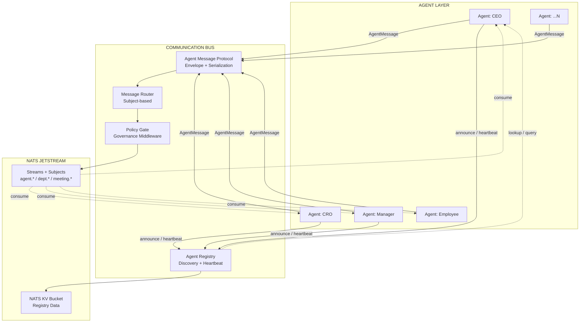
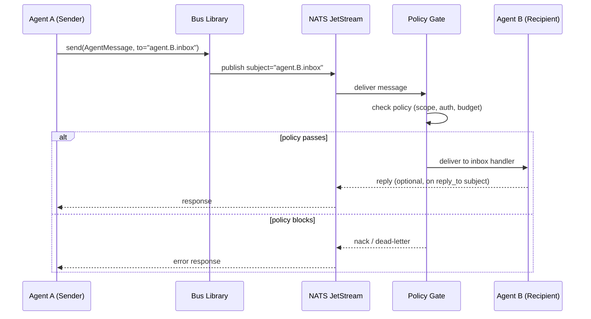
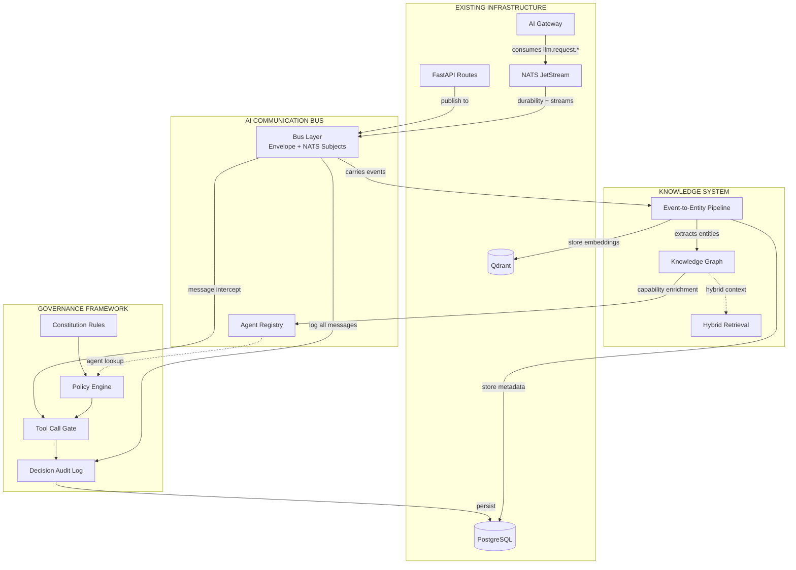

# AI Communication Bus — Specification

> **Phase:** 0 (Design & Skeleton)  
> **Status:** Draft for review  
> **Governs:** All inter-agent messaging, agent discovery, and NATS subject naming for agent-to-agent communication  
> **Governed by:** [architecture.md](../../architecture.md) (event-driven architecture, agent lifecycle, ADR-002), [architecture-review.md](../../architecture-review.md) (modularity standards)

---

## Table of Contents

1. [Overview & Architecture](#1-overview--architecture)
2. [Agent Message Protocol](#2-agent-message-protocol)
3. [Agent Registry — Service Interface](#3-agent-registry--service-interface)
4. [NATS Subject Naming Convention](#4-nats-subject-naming-convention)
5. [Cross-System Dependency Mapping](#5-cross-system-dependency-mapping)
6. [Design Decisions](#6-design-decisions)
7. [Integration Points with Existing Code](#7-integration-points-with-existing-code)
8. [Implementation Roadmap](#8-implementation-roadmap)

---

## 1. Overview & Architecture

The AI Communication Bus is the **nervous system of the agent office**. Every inter-agent message, every discovery announcement, every coordination signal flows through it. It replaces ad-hoc point-to-point wiring with a single, versioned, observable protocol that all agents speak.

### 1.1 Role in the System

Existing infra (architecture.md SS2.4) uses NATS JetStream for machine-to-machine events: `sim.tick.*`, `sim.event.*`, `llm.request.*`, `notify.*`. This spec **extends** that foundation with agent-to-agent messaging, agent discovery, and rich communication patterns (DM, channel, meeting, vote, emergency).

### 1.2 Three-Layer Stack

```
  +-------------------------------------------------------------------+
  |                    COMMUNICATION PATTERNS                          |
  |  DM  |  Channel  |  Meeting  |  Vote  |  Emergency  |  Broadcast  |
  +-------------------------------------------------------------------+
  |                    MESSAGE ENVELOPE PROTOCOL                       |
  |  AgentMessage<T>  |  AgentAnnouncement  |  CapabilityDeclaration  |
  +-------------------------------------------------------------------+
  |                       NATS TRANSPORT                               |
  |  JetStream Streams  |  Key-Value Store  |  Request-Reply  |  Pub  |
  +-------------------------------------------------------------------+
```

**Layer 1 -- NATS Transport:** The existing NATS JetStream cluster (ADR-002). Provides durable streams, work queues, pub-sub, request-reply, and a KV bucket. Every capability below maps to one of these NATS primitives.

**Layer 2 -- Message Envelope Protocol:** A Pydantic envelope (`AgentMessage<T>`) that wraps every inter-agent payload. Provides message_id, sender, recipient, thread_id, trace_id, priority, TTL, and an optional signature. All agents read and write this format exclusively -- no raw NATS messages.

**Layer 3 -- Communication Patterns:** Built on top of the envelope. Implemented as NATS subject conventions (see SS4) plus lightweight routing logic in the bus library. Phase 0 covers the envelope and registry; Phase 1+ adds the patterns.

### 1.3 Architecture Diagram



**Data flow for a direct message (agent A to agent B):**



---

## 2. Agent Message Protocol

### 2.1 Type Aliases and Enums

```python
from __future__ import annotations

import enum
from datetime import datetime
from typing import Any, Generic, List, Optional, TypeVar

from pydantic import BaseModel, Field


# ── Primitive Types ──────────────────────────────────────────────────

class AgentID(str):
    """Unique identifier for an agent.
    Format: ulid or uuid — e.g. '01J7XYZ...' or 'ag_ceo_acme_01J7...'.
    """


class ChannelRef(str):
    """Reference to a named communication channel.
    Format: 'dept.{dept_id}' or 'channel.{name}'.
    """


# ── Enums ────────────────────────────────────────────────────────────

class MessageType(str, enum.Enum):
    """Classifies every inter-agent message for routing and prioritization."""

    DIRECT    = "direct"      # 1:1 agent-to-agent
    CHANNEL   = "channel"     # 1:N department/group broadcast
    MEETING   = "meeting"     # Structured turn-taking (motion, argument)
    VOTE      = "vote"        # Ballot submission
    EMERGENCY = "emergency"   # Priority broadcast, all agents must ack
    WHISPER   = "whisper"     # Private DM (excluded from audit surface)
    COMMAND   = "command"     # Authoritative instruction (superior -> subordinate)
    QUERY     = "query"       # Request-reply: ask for information


class AgentTier(str, enum.Enum):
    """Hierarchical tier for routing, priority, and capability access."""

    FRONTLINE = "frontline"   # Day-to-day operational agents (Employee)
    MANAGER   = "manager"     # Team coordination (Manager, Head of Dept)
    EXECUTIVE = "executive"   # Company leadership (CEO, CRO, CTO)
    BOARD     = "board"       # Board-level (sparse, high-authority)


class AgentStatus(str, enum.Enum):
    """Lifecycle status of an agent."""

    ACTIVE  = "active"
    BUSY    = "busy"
    OFFLINE = "offline"
```

### 2.2 Core Envelope

```python
# ── The Universal Envelope ───────────────────────────────────────────

T = TypeVar("T")


class AgentMessage(BaseModel, Generic[T]):
    """Universal envelope for ALL inter-agent communication.

    Every message between agents (DM, channel post, meeting statement,
    vote, command, query) is wrapped in this envelope. The payload type
    varies by message_type.
    """

    message_id: str = Field(
        ...,
        description="ULID string — time-sortable, globally unique, no central sequence",
    )
    sender: AgentID = Field(
        ...,
        description="AgentID of the sender",
    )
    recipient: Optional[AgentID | List[AgentID] | ChannelRef] = Field(
        None,
        description=(
            "Target of the message. "
            "AgentID = direct message to one agent. "
            "List[AgentID] = multicast to named agents. "
            "ChannelRef = publish to a channel (dept.{id} or channel.{name}). "
            "None = broadcast to all reachable agents."
        ),
    )
    thread_id: Optional[str] = Field(
        None,
        description="Groups messages into conversations. First message in a thread generates a new ULID.",
    )
    reply_to: Optional[str] = Field(
        None,
        description="message_id this is replying to. Enables request-reply correlation.",
    )
    message_type: MessageType = Field(
        ...,
        description="Classifies the message for routing and priority handling.",
    )
    priority: int = Field(
        default=3,
        ge=1,
        le=5,
        description=(
            "Message priority 1-5. 5 = highest. "
            "5: emergency / executive command. "
            "4: time-sensitive (meeting vote with deadline). "
            "3: normal operational message. "
            "2: low-priority (digest, periodic report). "
            "1: background / informational."
        ),
    )
    ttl_seconds: int = Field(
        default=300,
        description="Message expiry in seconds. 0 = never expires (use sparingly).",
    )
    payload: T = Field(
        ...,
        description="The actual message content. Schema varies by message_type.",
    )
    trace_id: str = Field(
        ...,
        description="Propagation trace ID from architecture.md SS7. Links this message to the originating request/simulation tick.",
    )
    timestamp: datetime = Field(
        default_factory=datetime.utcnow,
        description="When the sender created this message (UTC). NOT when NATS received it.",
    )
    signature: Optional[str] = Field(
        None,
        description="HMAC or asymmetric signature for sender verification. Phase 2+.",
    )


# ── Registry Types ───────────────────────────────────────────────────

class AgentAnnouncement(BaseModel):
    """Agent registration heartbeat — sent on startup and periodically.

    Published to the 'agent.registry.announce' subject so the registry
    and other agents learn about this agent's existence and capabilities.
    """

    agent_id: AgentID = Field(
        ...,
        description="Unique agent identifier",
    )
    agent_type: str = Field(
        ...,
        description="Semantic type label, e.g. 'ceo', 'cro', 'manager', 'employee', 'board'",
    )
    agent_role: str = Field(
        ...,
        description="Human-readable role description, e.g. 'Chief Risk Officer'",
    )
    capabilities: List[CapabilityDeclaration] = Field(
        default_factory=list,
        description="What this agent can do — used for routing and discovery",
    )
    tier: AgentTier = Field(
        ...,
        description="Hierarchical tier for priority and access control",
    )
    department_id: Optional[str] = Field(
        None,
        description="Department this agent belongs to, e.g. 'risk', 'engineering', 'finance'",
    )
    status: AgentStatus = Field(
        default=AgentStatus.ACTIVE,
        description="Current agent status",
    )


class CapabilityDeclaration(BaseModel):
    """Describes a single capability an agent exposes.

    Used by the Agent Registry to route discovery queries.
    """

    name: str = Field(
        ...,
        description="Unique capability name, e.g. 'risk_assessment', 'employee_onboarding'",
    )
    description: str = Field(
        ...,
        description="Human-readable description of what this capability provides",
    )
    input_schema: dict = Field(
        default_factory=dict,
        description="JSON Schema describing the expected input payload",
    )
    output_schema: dict = Field(
        default_factory=dict,
        description="JSON Schema describing the output/response payload",
    )
```

### 2.3 Payload Schemas by MessageType

Each `message_type` implies a specific payload schema inside the generic `AgentMessage.payload`:

| `message_type` | Payload Type | Description |
|---|---|---|
| `DIRECT` | `str` or `dict` | Free-form message body |
| `CHANNEL` | `str` or `dict` | Channel post body |
| `MEETING` | `MeetingStatement` | Motion, argument, or question in a meeting |
| `VOTE` | `Vote` | Ballot with choice + rationale |
| `EMERGENCY` | `EmergencyMessage` | Alert level + details + required actions |
| `WHISPER` | `str` or `dict` | Private message (excluded from audit) |
| `COMMAND` | `CommandPayload` | Instruction with authority level + deadline |
| `QUERY` | `QueryPayload` | Question with expected response schema |

```python
# ── Payload Sub-Schemas (future, defined here for completeness) ─────

class MeetingStatement(BaseModel):
    """A statement uttered in a structured meeting."""
    motion_id: str
    statement_type: str  # 'motion', 'argument_for', 'argument_against', 'question', 'point_of_order'
    content: str
    speaker: AgentID


class Vote(BaseModel):
    """A ballot submitted in a vote."""
    motion_id: str
    choice: str            # 'for', 'against', 'abstain', 'veto'
    rationale: str
    weight: float = 1.0    # Multiplier based on voter role (CEO=3, CRO=2)

class EmergencyMessage(BaseModel):
    """Emergency broadcast payload."""
    level: int             # 1 (advisory) / 2 (urgent) / 3 (all-hands halt)
    title: str
    details: str
    required_actions: list[str]
    ack_deadline_seconds: int


class CommandPayload(BaseModel):
    """Authoritative instruction."""
    command: str
    parameters: dict
    authority_level: int   # Must match or exceed recipient tier
    deadline: Optional[datetime]


class QueryPayload(BaseModel):
    """Request-reply query."""
    question: str
    expected_response_schema: Optional[dict]  # JSON Schema hint
    query_type: str          # 'factual', 'opinion', 'decision', 'status'
```

---

## 3. Agent Registry -- Service Interface

### 3.1 Interface Definition

```python
from abc import ABC, abstractmethod
from typing import List, Optional


class AgentRegistry(ABC):
    """Service interface for agent discovery and lifecycle.

    Implementations must be thread-safe and support concurrent access
    from multiple agent runner workers.
    """

    @abstractmethod
    async def register(self, announcement: AgentAnnouncement) -> str:
        """Register or heartbeat an agent.

        Creates a new registration if the agent_id is unknown, or
        refreshes the TTL of an existing registration.

        Returns the agent_id as confirmation.
        """
        ...

    @abstractmethod
    async def unregister(self, agent_id: AgentID) -> None:
        """Remove an agent from the registry (on graceful shutdown)."""
        ...

    @abstractmethod
    async def lookup(self, agent_id: AgentID) -> Optional[AgentAnnouncement]:
        """Retrieve a single agent's announcement by ID.

        Returns None if the agent is not registered or has expired.
        """
        ...

    @abstractmethod
    async def query_by_capability(
        self, name: str
    ) -> List[AgentAnnouncement]:
        """Find all agents that declare a capability with the given name."""
        ...

    @abstractmethod
    async def query_by_department(
        self, dept_id: str
    ) -> List[AgentAnnouncement]:
        """Find all agents in a department."""
        ...

    @abstractmethod
    async def query_by_role(self, role: str) -> List[AgentAnnouncement]:
        """Find all agents with a given role label."""
        ...

    @abstractmethod
    async def get_all_active(self) -> List[AgentAnnouncement]:
        """Return all currently registered and active agents."""
        ...
```

### 3.2 Storage Architecture

The registry uses a **two-tier storage strategy**:

**Tier 1 -- NATS Key-Value Bucket (live data):**
- Bucket name: `agent_registry`
- Key format: `agent.{agent_id}` -- value is the serialized `AgentAnnouncement` JSON
- TTL per key: 60 seconds (agents must heartbeat every 30s to stay registered)
- NATS KV Watch: consumers can subscribe to bucket changes for real-time discovery
- This aligns with ADR-002 (NATS as central nervous system) -- no new service needed

**Tier 2 -- PostgreSQL (history + audit):**
- A new `agent_registration_history` table records every register/unregister event
- Used for forensics, uptime tracking, and communication audit (Phase 1)
- Insert-only, no updates -- each heartbeat creates a row with `seen_at` timestamp

```sql
-- Agent registration history (Phase 0 — schema only, optional)
CREATE TABLE agent_registration_history (
    id          UUID PRIMARY KEY DEFAULT gen_random_uuid(),
    agent_id    TEXT NOT NULL,
    event_type  TEXT NOT NULL,     -- 'register', 'heartbeat', 'unregister'
    announcement JSONB NOT NULL,
    seen_at     TIMESTAMPTZ NOT NULL DEFAULT now()
);

CREATE INDEX idx_agent_reg_history_agent ON agent_registration_history(agent_id, seen_at DESC);
```

### 3.3 Agent Bootstrap and Discovery Flow

```mermaid
sequenceDiagram
    participant A as Agent (new)
    participant REG as Agent Registry
    participant KV as NATS KV (agent_registry)
    participant ANNOUNCE as Subject: agent.registry.announce
    participant B as Agent B (peer)
    participant C as Agent C (peer)

    Note over A: 1. Agent starts up

    A->>REG: register(AgentAnnouncement)
    REG->>KV: put("agent.{id}", announcement, ttl=60s)
    REG-->>A: ok (agent_id)

    REG->>ANNOUNCE: publish(AgentAnnouncement)
    ANNOUNCE-->>B: notify: new agent arrived
    ANNOUNCE-->>C: notify: new agent arrived

    Note over A,B,C: 2. Other agents learn about newcomer

    B->>REG: query_by_capability("risk_assessment")
    REG->>KV: list keys / get values
    KV-->>REG: [AgentAnnouncement(CEO), AgentAnnouncement(CRO), ...]
    REG-->>B: [AgentAnnouncement(CRO, tier=executive, ...)]

    Note over A: 3. Agent heartbeats every 30s

    loop every 30 seconds
        A->>REG: register(AgentAnnouncement)  -- refreshes TTL
        REG->>KV: put("agent.{id}", announcement, ttl=60s)
        REG-->>A: ok
    end

    Note over A: 4. Agent shuts down gracefully

    A->>REG: unregister(agent_id)
    REG->>KV: delete("agent.{id}")
    REG->>ANNOUNCE: publish(status=offline)
```

**Key properties of the discovery flow:**

- **No single point of failure:** If the registry service is down, agents can still discover each other by subscribing to `agent.registry.announce` and caching. The NATS KV bucket is also directly readable.
- **Eventually consistent:** An agent is considered "offline" after 60s without a heartbeat (2 missed intervals). This prevents flapping.
- **Push + Pull:** Agents receive push notifications on `agent.registry.announce` for new arrivals and departures. For ad-hoc queries, they use the `query_by_*` methods. For advanced on-demand lookup, the `agent.registry.query` request-reply subject is available (see SS4).

---

## 4. NATS Subject Naming Convention

### 4.1 Convention Rules

All subjects follow the pattern:

```
{namespace}.{entity}.{qualifier}[.{sub-qualifier}]
```

- **Lowercase only.** No camelCase or snake_case in subject tokens.
- **ULID identifiers** where entity IDs are needed (consistent with tech-stack.md SS2.2 UUID v7).
- **Dot-separated.** NATS subjects use dots as delimiters; wildcards `*` (single token) and `>` (multi-token) work naturally.
- **Company-scoped subjects** use `{company_id}` as a token for multi-tenant isolation (architecture.md SS6).

### 4.2 Full Subject Table

| Subject Pattern | NATS Pattern | Payload Schema | TTL / Retention | Use |
|---|---|---|---|---|
| **Agent Messaging (Phase 0 -- skeleton, Phase 1 -- full)** |
| `agent.{id}.inbox` | Request-Reply / Sub | `AgentMessage` | 1h / Work queue | Direct messages to a specific agent. Each agent subscribes to its own inbox. Reply subject auto-generated by NATS. |
| `agent.{id}.outbox` | Sub | `AgentMessage` | 1h | Outbound sentinel. Agent publishes here for audit/logging after sending. Optional -- for observability. |
| `dept.{dept_id}.channel` | Pub-sub | `AgentMessage` | 24h | Department broadcast. All agents in the department subscribe. Messages are not consumed (fan-out to all subscribers). |
| `channel.{name}` | Pub-sub | `AgentMessage` | 24h | Named channel for cross-department topics (e.g. `channel.strategy`, `channel.social`). |
| `meeting.{id}.speak` | Queue (work queue) | `MeetingStatement` | 7d | Turn-taking in a meeting context. Queue group ensures one consumer processes each statement in order. |
| `meeting.{id}.vote` | Queue (work queue) | `Vote` | 7d | Ballot submission for a meeting. Queue group for ordered tallying. |
| `meeting.{id}.control` | Pub | `MeetingControl` | 7d | Chairperson commands: 'start', 'pause', 'adjourn', 'call_to_order'. Published, not queued. |
| `emergency.{level}` | Pub (high priority) | `EmergencyMessage` | 7d | Emergency broadcast. Level 1 = advisory, 2 = urgent, 3 = all-hands halt normal processing. Highest priority delivery. |
| `emergency.{level}.ack.{agent_id}` | Sub | `EmergencyAck` | 7d | Per-agent acknowledgement of an emergency broadcast. |
| **Registry (Phase 0)** |
| `agent.registry.announce` | Pub | `AgentAnnouncement` | 24h | Agent capability broadcast on startup and on status change. All agents subscribe to learn about peers. |
| `agent.registry.query` | Request-Reply | `RegistryQuery` / `RegistryResponse` | — | On-demand lookup. Send a `RegistryQuery`, receive a `RegistryResponse`. Useful when cache is stale. |
| **Existing infra (architecture.md SS2.4, tech-stack.md SS2.4)** |
| `sim.tick.{company_id}` | Stream (work queue) | `SimulationTick` | 7d | Tick progression from simulation engine (EXISTING, unchanged). |
| `sim.event.{company_id}` | Stream | `SimEvent` | 30d | Simulation events for consumers (EXISTING, unchanged). |
| `llm.request.{model}` | Stream (work queue) | `LLMRequest` | 1h | LLM inference requests to AI Gateway (EXISTING, unchanged). |
| `llm.response.{trace_id}` | Request-Reply | `LLMResponse` | — | LLM response back to caller (EXISTING, unchanged). |
| `notify.{user_id}` | Pub-sub | `Notification` | — | Real-time notifications to UI (EXISTING, unchanged). |

### 4.3 Registry Query Schema

```python
class RegistryQuery(BaseModel):
    """Query payload for the agent.registry.query request-reply subject."""

    query_type: str = Field(
        ...,
        description="One of: 'by_capability', 'by_department', 'by_role', 'by_id', 'all_active'",
    )
    query_value: Optional[str] = Field(
        None,
        description="Value to match, e.g. capability name, department ID, role label, or agent ID",
    )


class RegistryResponse(BaseModel):
    """Response payload for the agent.registry.query reply."""

    results: List[AgentAnnouncement] = Field(
        default_factory=list,
        description="Matching agent announcements",
    )
    total_count: int = Field(
        default=0,
        description="Total number of matching agents",
    )
```

### 4.4 Subject Mapping by Communication Pattern

| Pattern | NATS Primitive | Subject(s) |
|---|---|---|
| **Direct Message (1:1)** | Request-Reply | `agent.{recipient}.inbox` |
| **Multicast (1:N)** | Request-Reply (NATS multi-reply) | `agent.{id1}.inbox`, `agent.{id2}.inbox`, ... |
| **Department Channel (1:N)** | Pub-sub | `dept.{dept_id}.channel` |
| **Topic Channel (1:N)** | Pub-sub | `channel.{name}` |
| **Meeting (N:M)** | Queue + Pub | `meeting.{id}.speak`, `meeting.{id}.vote`, `meeting.{id}.control` |
| **Emergency (1:ALL)** | Pub | `emergency.{level}` |
| **Whisper (1:1, private)** | Request-Reply | `agent.{recipient}.inbox` (with `message_type=whisper`) |
| **Broadcast (1:ALL)** | Pub | Wildcard `agent.>.inbox` or dedicated pattern (Phase 2) |

---

## 5. Cross-System Dependency Mapping

### 5.1 Dependency Diagram



### 5.2 Knowledge System Dependencies

| Dependency | Direction | Description |
|---|---|---|
| **Bus carries events --> Knowledge System** | Bus -> Knowledge | The Knowledge System's Event-to-Entity pipeline subscribes to `sim.event.*` and (in Phase 1) `agent.*.outbox` to extract entities and relationships. Every agent decision becomes a graph node. |
| **Knowledge System enriches Registry** | Knowledge -> Bus | The Agent Registry can enrich its responses with graph-derived context (org hierarchy, department relationships). For example, `query_by_department("risk")` can also return the chain of command from the KG. |
| **Agents query KG via Bus** | Bus <-> Knowledge | Agents send queries through the bus (`query` message_type) to the Knowledge System's hybrid retrieval endpoint. The bus carries request and response transparently. |

### 5.3 Governance Framework Dependencies

| Dependency | Direction | Description |
|---|---|---|
| **Governance checks messages on the bus** | Bus -> Governance | The Governance Framework attaches a **policy middleware** subscriber on `agent.*.inbox` (and `agent.*.outbox` for sentinel). Every `AgentMessage` is checked against policy before delivery. This is the only non-agent subscriber on inbox subjects. |
| **Governance provides trace_id chain** | Governance -> Bus | The Governance Framework mandates that every `AgentMessage` carry a valid `trace_id` linked to a decision log entry. Messages without a trace_id are rejected at the policy gate. |
| **Agent Registry supports policy queries** | Bus -> Governance | The Policy Engine uses the Agent Registry to check agent tier, department, and capabilities when evaluating policy rules. For example, "is this agent executive-tier and authorized to issue a COMMAND?" |

### 5.4 Existing Infrastructure Dependencies

| Dependency | Direction | Description |
|---|---|---|
| **FastAPI routes publish to bus** | FastAPI -> Bus | External API calls (e.g., admin sending a message as an agent, triggering an emergency broadcast) publish to NATS subjects via the bus library. |
| **NATS JetStream provides durability** | NATS -> Bus | All `AgentMessage` payloads are serialized to JSON and published to NATS subjects. JetStream provides at-least-once delivery, message replay, and retention. No new infrastructure service is needed. |
| **AI Gateway consumes llm.request.*** | AI Gate -> NATS | Agents request LLM inference by publishing `llm.request.{model}` (existing pattern). This is unchanged -- agents use the same mechanism via the bus library. |

---

## 6. Design Decisions

This section captures the design rationale for the key decisions in this spec. Each item could become a full ADR in `docs/adr/`; for now they are embedded here as lightweight records.

### 6.1 Why an AgentMessage Envelope (not bare NATS messages)

| Aspect | Bare NATS Message | AgentMessage Envelope |
|---|---|---|
| Versioning | None -- payload schema changes break consumers | `message_type` + `payload` generic allow schema evolution per type |
| Routing | Agents must parse every message to decide relevance | `recipient`, `message_type`, `priority` enable fast pre-filtering |
| Audit | No standard fields for traceability | `message_id`, `sender`, `trace_id`, `timestamp` are mandatory |
| Security | No sender verification | `signature` field (Phase 2) enables HMAC verification |

**Decision:** Wrap all inter-agent payloads in `AgentMessage<T>`. This is the **single point of evolution** for the agent communication protocol. Raw NATS messages are used only for existing machine-to-machine subjects (`sim.tick.*`, `sim.event.*`, `llm.request.*`, `notify.*`), which are not agent-to-agent.

### 6.2 Why NATS KV for the Registry

- **ADR-002** already establishes NATS as the central nervous system. The KV bucket is a built-in NATS feature -- no new service (Neo4j, Redis, etc.) is required for Phase 0.
- **No SPOF:** The KV bucket survives registry service restarts. Agents can read it directly.
- **TTL-based expiry:** Automatic heartbeat timeout without a background janitor process.
- **Watch capability:** Consumers can `watch()` the bucket for real-time updates, eliminating the need for polling.

**Decision:** NATS KV bucket `agent_registry` is the primary store. PostgreSQL is optional history (Phase 1).

### 6.3 Why ULID for message_id

| Feature | UUID v4 | UUID v7 | ULID | Auto-increment |
|---|---|---|---|---|
| Time-sortable | No | Yes (ms) | Yes (ms) | Yes |
| No central coordinator | Yes | Yes | Yes | No |
| Lexicographically sortable | No | Approx | Yes (Crockford base32) | Yes |
| URL-safe | Yes | Yes | Yes (case-insensitive) | Yes |
| Payload size | 36 chars | 36 chars | 26 chars | Varies |

**Decision:** Use **ULID** for `message_id`, `thread_id`, and any new event IDs generated by the bus. This is consistent with the existing `sim_events` table using UUID v7 (which is time-sortable). ULID is more compact (26 chars vs 36) and lexicographically sortable, which aids debugging and log correlation.

### 6.4 Why a Generic Envelope (not separate subjects per message_type)

Subjects like `agent.{id}.dm`, `agent.{id}.command`, `agent.{id}.query` would multiply the subject namespace by 8x and require agents to subscribe to multiple subjects per inbox. Instead, the `message_type` field inside a single envelope on `agent.{id}.inbox` provides the same routing information with one subscription per agent.

**Decision:** One inbox subject per agent. `message_type` discriminates inside the envelope.

### 6.5 Why AgentStatus enum and heartbeat on register()

The same `register()` method handles both initial registration and heartbeat (refresh TTL). This avoids a separate heartbeat RPC and keeps the interface minimal. The `AgentStatus` enum allows an agent to signal "I'm here but busy" without going offline.

---

## 7. Integration Points with Existing Code

### 7.1 Agent Lifecycle Mapping (architecture.md SS2.3)

The agent lifecycle defined in architecture.md SS2.3 maps to the bus as follows:

```
  ┌──────────┐       ┌──────────┐       ┌──────────┐       ┌──────────────┐
  │ RECEIVE  │       │  REASON  │       │   ACT    │       │    LEARN     │
  │ Context  │ ────▶ │  (LLM)   │ ────▶ │ Execute  │ ────▶ │ Store memory │
  │ from     │       │  Plan    │       │ action   │       │ in Qdrant    │
  │ NATS     │       │  Decide  │       │ in sim   │       │ Update state │
  └────┬─────┘       └──────────┘       └────┬─────┘       └──────┬───────┘
       │                                     │                     │
       ▼                                     ▼                     ▼
  ┌────────────────┐                  ┌────────────────┐   ┌───────────────┐
  │ Subscribe to   │                  │ Publish        │   │ Publish       │
  │ agent.{id}.    │                  │ AgentMessage   │   │ event to      │
  │ inbox          │                  │ to BUS         │   │ sim.event.*   │
  │ (and other     │                  │ or call tool   │   │ or agent.*.   │
  │  subjects)     │                  │ via tool gate  │   │ outbox        │
  └────────────────┘                  └────────────────┘   └───────────────┘
```

**RECEIVE phase:** Agent subscribes to its own inbox (`agent.{id}.inbox`) and relevant channels (`dept.{dept_id}.channel`, `channel.{name}`, `emergency.{level}`). The bus library handles subscription management.

**ACT phase:** Agent publishes messages via the bus library, which wraps the payload in `AgentMessage`, assigns `message_id`, `trace_id`, `timestamp`, and publishes to the appropriate NATS subject. If the action modifies simulation state, it also emits to `sim.event.*`.

**LEARN phase:** Agent publishes to `agent.{id}.outbox` (optional sentinel) or the memory indexer subscribes to `agent.*.outbox` for entity extraction. The existing `sim.event.*` consumer pipeline remains unchanged.

### 7.2 sim_events Table Extension (architecture.md SS3.2)

Every `AgentMessage` published through the bus **should be logged** to the `sim_events` table for auditing. This extends the existing table definition:

```sql
-- Extended sim_events table (existing from architecture.md §3.2)
CREATE TABLE sim_events (
    id          UUID PRIMARY KEY DEFAULT gen_random_uuid(),
    company_id  UUID NOT NULL REFERENCES companies(id),
    tick_id     UUID REFERENCES sim_ticks(id),
    event_type  TEXT NOT NULL,                    -- 'agent.message.direct', 'agent.message.channel', etc.
    source      TEXT NOT NULL,                    -- 'agent:01J7XYZ...', 'sim-engine', 'system'
    trace_id    TEXT,
    data        JSONB NOT NULL,                   -- Full AgentMessage envelope JSON
    created_at  TIMESTAMPTZ NOT NULL DEFAULT now()
);
```

**Mapping of AgentMessage fields to sim_events columns:**

| `sim_events` column | Source from `AgentMessage` |
|---|---|
| `id` | New UUID (or ULID, convertible via `gen_ulid_to_uuid()` helper) |
| `company_id` | Extracted from `trace_id` context or message metadata |
| `tick_id` | Extracted from `trace_id` context (if within a simulation tick) |
| `event_type` | `f"agent.message.{message_type.value}"` |
| `source` | `f"agent:{sender}"` |
| `trace_id` | `trace_id` |
| `data` | Full `AgentMessage.model_dump_json()` |

**No schema migration is required for Phase 0** -- the table already accepts JSONB in `data`. The bus library will include an optional logging hook that writes to `sim_events`. By Phase 1 this becomes a mandatory NATS consumer.

### 7.3 No New Infrastructure Services

All components described in this spec are **pure code** deployed as:

- **Bus library** (`app/infrastructure/bus/`): Python package providing `AgentMessage`, `AgentRegistry`, publisher, subscriber, and serialization. Imported by agent runners, API routes, and workers.
- **Registry service**: A lightweight module that runs inside the existing worker process or as a standalone worker (fits `app/workers/agent_registry.py`). Communicates only with NATS -- no HTTP endpoint needed.
- **Policy middleware**: A NATS subscriber-side interceptor deployed in the governance worker. Described here for interface purposes; implementation is in the Governance Framework spec.

No changes to `docker-compose.yml`. The existing NATS container handles all bus traffic. New consumers are configured through NATS stream/consumer API at startup, not through Compose.

### 7.4 Directory Structure Additions

This spec maps to the existing directory structure (architecture.md SS8) as follows:

```
app/
├── domain/
│   ├── models/
│   │   └── bus.py             # AgentMessage, AgentAnnouncement, CapabilityDeclaration, enums
│   ├── ports/
│   │   └── agent_registry.py  # AgentRegistry ABC
│   └── events/
│       └── bus.py             # Bus-specific event definitions
├── infrastructure/
│   ├── bus/
│   │   ├── __init__.py
│   │   ├── client.py          # BusClient: publish, send, subscribe helpers
│   │   ├── serializer.py      # Envelope serialization / deserialization
│   │   ├── registry.py        # AgentRegistry implementation (NATS KV backend)
│   │   └── middleware.py       # Policy gate hook interface
│   └── db/
│       └── models.py          # Add agent_registration_history table (optional)
└── workers/
    └── agent_registry.py      # Registry heartbeat consumer (optional standalone worker)
```

---

## 8. Implementation Roadmap

### Phase 0 (NOW -- Design & Skeleton)

| # | Component | Deliverable | Effort | Dependencies |
|---|---|---|---|---|
| 1 | **AgentMessage Protocol** | Pydantic models in `app/domain/models/bus.py`: `AgentMessage`, `AgentAnnouncement`, `CapabilityDeclaration`, enums, payload schemas | 1 day | None |
| 2 | **Bus Library -- Publisher** | `app/infrastructure/bus/client.py`: `BusClient.publish()` wraps payload in `AgentMessage`, assigns `message_id` (ULID), `trace_id`, `timestamp`, publishes to NATS subject | 1 day | #1 |
| 3 | **Bus Library -- Subscriber** | `BusClient.subscribe()` registers a callback on a NATS subject, deserializes to `AgentMessage`, invokes handler | 1 day | #1 |
| 4 | **Agent Registry Service** | `app/infrastructure/bus/registry.py`: implements `AgentRegistry` ABC with NATS KV backend. `register()`, `unregister()`, `lookup()`, `query_by_capability()`, `query_by_department()`, `query_by_role()`, `get_all_active()` | 1 day | #2, #3 |
| 5 | **Subject Wiring** | Bus client auto-subscribes to `agent.registry.announce` on init. Agents call `register()` on startup and heartbeat every 30s | 0.5 day | #2, #3, #4 |
| 6 | **NATS KV Bucket Setup** | Bootstrap script to create `agent_registry` KV bucket with 60s TTL. Runs at NATS connection time | 0.5 day | None |
| 7 | **Integration Tests** | Test envelope round-trip, registry register/lookup/query, heartbeat expiry | 1 day | #1-#6 |

**Total Phase 0 effort:** ~6 days

**Phase 0 Gate:** A test where Agent A sends a `DIRECT` message to Agent B (both simulated in-process) and Agent B receives and decodes the `AgentMessage` envelope. The registry correctly returns Agent B when queried by capability.

### Phase 1 (Core Infrastructure)

| # | Component | Description |
|---|---|---|
| 1 | **DM Pattern (full)** | Request-reply on `agent.{id}.inbox` with automatic reply subject, timeout, and retry. BusClient.send() with response await. |
| 2 | **Channel Pattern** | `dept.{dept_id}.channel` pub-sub. BusClient.subscribe_channel() / publish_channel(). |
| 3 | **Emergency Broadcast** | `emergency.{level}` pub with mandatory agent acknowledgement. BusClient.send_emergency(). |
| 4 | **Communication Audit** | All agent messages logged to `sim_events` table via dedicated consumer. `agent_registration_history` PostgreSQL table for registry audit. |
| 5 | **Policy Middleware Stub** | Governance framework attaches a policy checker subscriber on `agent.*.inbox`. Messages that fail policy are nacked and dead-lettered. |
| 6 | **Agent Outbox Sentinel** | `agent.{id}.outbox` -- optional publish after each send for observability. |

### Phase 2 (Advanced Capabilities)

| # | Component | Description |
|---|---|---|
| 1 | **Meeting/Debate System** | `meeting.{id}.speak` (queue for ordered turn-taking), `meeting.{id}.vote`, `meeting.{id}.control` (chairperson commands). Meeting lifecycle manager. |
| 2 | **Vote / Committee** | Weighted voting, quorum detection, eligibility rules. `Vote` payload schema with `weight`. |
| 3 | **MCP Gateway** | Bridge between NATS bus and MCP tools. Agents send MCP tool requests through the bus; the gateway routes to external MCP servers. |
| 4 | **Sub-agent Context Propagation** | Parent-child trace_id inheritance. Agent spawns sub-agent with inherited context (company_id, dept_id, auth). |
| 5 | **Emergency Acknowledgment Tracking** | Dashboard for tracking which agents have acked an emergency broadcast. Escalation on missing acks. |

### Phase 3 (Production Hardening)

| # | Component | Description |
|---|---|---|
| 1 | **Full Policy Middleware** | All agent messages go through governance policy check before delivery. Policy rules are loaded from the Policy Engine. |
| 2 | **Message Encryption** | End-to-end encryption for WHISPER and sensitive COMMAND messages. `signature` field becomes mandatory for all messages. |
| 3 | **Load Testing & Scaling** | Benchmark bus throughput with 100+ simulated agents. Tune NATS consumer settings. |
| 4 | **Monitoring & Dashboards** | Prometheus metrics for bus latency, message throughput, registry size, policy rejection rate. Grafana dashboard. |

---

## References

- [architecture.md](../../architecture.md) -- System architecture, agent lifecycle SS2.3, event-driven architecture SS2.4, sim_events table SS3.2, event schema SS2.4
- [architecture-review.md](../../architecture-review.md) -- Modularity standards, governance L1-L4
- [tech-stack.md](../../tech-stack.md) -- NATS SS2.4, existing subject table, version policy
- [research-report.md](../../research-report.md) -- Phase 0 scope SS4.2, NATS subject design SS1.5, roadmap SS4.2
- [ADR-002](../../architecture.md#adr-002-nats-over-redis-streams--rabbitmq) -- NATS as central nervous system
