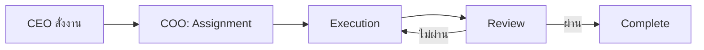

# Workflow ของบริษัท — CEO สั่ง → Assignment → Execution → Review → Complete



---

## 1. CEO สั่งงาน (Input)

- CEO ส่งคำสั่ง/Feature request/Bug report มาในแชท หรือผ่าน `/task`
- ทุกงานต้องมี:
  - **คำอธิบาย** — ต้องการอะไร
  - **เกณฑ์สำเร็จ** — วัดยังไงว่าทำเสร็จ
  - **Priority** — Urgent / High / Medium / Low
  - **Deadline** (optional) — ถ้ามีกำหนดส่ง
- COO บันทึกงานลง Task List ทันที

## 2. Assignment (COO)

- COO วิเคราะห์งาน: อะไรต้องทำ ต้องใช้อะไร ใครเหมาะที่สุด
- แตกงานย่อยถ้าจำเป็น
- มอบหมายให้ Agent ที่เหมาะสม (Dev, Designer, Researcher, …)
- ตั้งค่า:
  - **Owner** — ใครรับผิดชอบ
  - **Dependency** — ติดอะไรอยู่ไหม
  - **Branch** (ถ้าเป็นโค้ด) — สร้าง branch จาก main

## 3. Execution

- ลงมือทำงานตามที่ได้รับมอบหมาย
- Commit เมื่อถึง checkpoint ที่มีความหมาย (อย่ารอให้เสร็จใหญ่ค่อย commit)
- กรณีติดขัด/ไม่แน่ใจ:
  - ถ้าติด dependency → Tag COO
  - ถ้าต้องตัดสินใจ → Tag CEO พร้อมเสนอ options
- **ห้าม** ทิ้ง process/server/daemon ค้างไว้ — ปิดให้เรียบร้อย
- ใช้ `TaskUpdate` เพื่ออัปเดตสถานะตลอดทาง

## 4. Review

- ทุกงานต้องผ่าน Review ก่อนถึงจะถือว่าสำเร็จ
- ระดับ Review:
  | ประเภทงาน | Review โดย |
  |---|---|
  | Code | Dev (code review) + Auto test |
  | Content/Design | CEO หรือผู้รับมอบ |
  | Research | CEO |
- Review เช็ค:
  1. ตรง requirement หรือเปล่า
  2. Edge cases จัดการไหม
  3. ถ้าเป็นโค้ด — มี test? เล่นแล้วไม่พัง?
  4. มีของค้าง (server, branch, temp file) หรือไม่
- ถ้าไม่ผ่าน → ส่งคืน Execution พร้อมเหตุผลชัดเจน

## 5. Complete

- อัปเดต Task → Complete
- Merge branch (ถ้ามี) → main
- เขียนสรุปผลส่ง CEO:
  - **สิ่งที่ทำ**
  - **สิ่งที่เจอระหว่างทาง** (bugs, decisions, tech debt)
  - **สิ่งที่ยังค้าง** (ถ้ามี — พร้อม reason)
- ลบ resources ชั่วคราว (worktrees, temp branches, env vars)
- บันทึกความจำที่ควรจำลง `MEMORY.md` / `coo.md` (ถ้ามี)

---

## Priority Matrix

| Priority | SLI (Service Level Indicator) |
|---|---|
| 🚨 Urgent | เริ่มภายใน 15 นาที |
| 🔴 High | เริ่มภายใน 2 ชม. |
| 🟡 Medium | เริ่มภายใน 24 ชม. |
| 🟢 Low | จัดการในรอบถัดไป |

## State Diagram

```
Pending → In Progress → Review → Complete
              ↓              ↑
           Blocked ──→ (รอ dependency)
```
